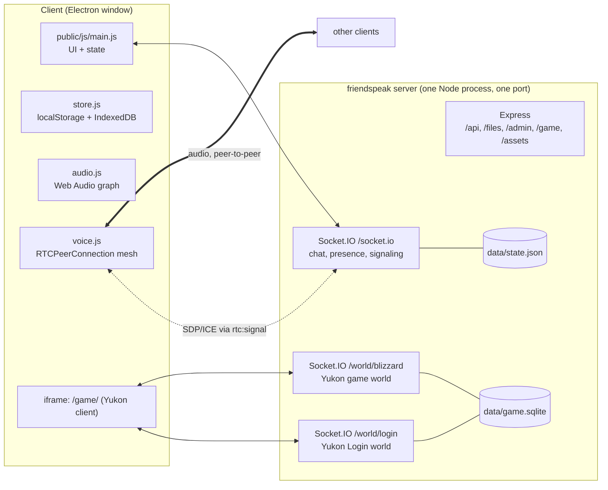
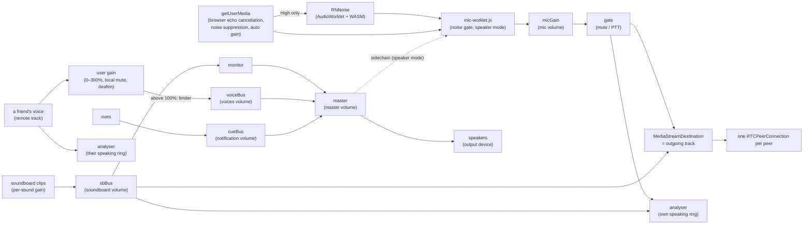

# Architecture

This covers how friendspeak is put together. For *why*, see [DECISIONS.md](DECISIONS.md). For the game, see [GAME.md](GAME.md).

## System overview



**One server process** serves everything on a single port (default 3000):

| Path | Served by | Purpose |
|---|---|---|
| `/` | Express | a plain-text notice; the server hosts no chat UI (D26) |
| `/socket.io/*` | Socket.IO (friendspeak, `serveClient: false`) | chat, presence, voice signaling, game login tokens |
| `/api/info` | Express | `{ name, password: bool }` |
| `/admin/*` | Express (`admin.js`) | the admin dashboard's files: `admin-ui/`, plus `public/js/util.js` as `/admin/js/util.js` (D34) |
| `/admin/api/*` | Express (`admin.js`) | the dashboard's JSON API and event stream (see "Admin dashboard") |
| `/game/*` | `game/client/dist` | the built Yukon client |
| `/game/friendspeak.js` | `game/index.js` | tells the game client its world paths |
| `/game/lib/*` | `node_modules/phaser/dist` | Phaser 3.80.1 |
| `/game/assets/*` and `/assets/*` | asset dirs (see GAME.md) | game art, crumbs, fonts, SWFs |
| `/world/login` | Socket.IO (Yukon Login world) | penguin login |
| `/world/<world>` | Socket.IO (Yukon game world) | gameplay |

A client can load its UI from **any** friendspeak server (usually its own, on localhost) and connect its socket to **another** server by IP. CORS is `*` for that reason.

## Server (`server.js`)

`startServer(opts) → Promise<{ port, version, https, fingerprint, name, admin: { enabled, local }, game, update, close() }>` is the only export used by callers (plus `lanAddresses()`). Running `node server.js` maps env vars to options (Docker runs the same CLI). The desktop app never runs a server.

### Configuration

| Option (`startServer`) | Env (CLI) | Default | Notes |
|---|---|---|---|
| `port` | `PORT` | 3000 | `0` = any free port |
| `host` | none | all interfaces | |
| `https` | `HTTPS=1` | off | self-signed cert generated into `dataDir` |
| `dataDir` | `DATA_DIR` | `./data` | `state.json`, `mail.json`, `admin.json`, `admin-audit.log`, `game.sqlite`, `game-secret`, certs |
| `serverName` | `SERVER_NAME` | `friendspeak` | name for a *new* server only; after that the name in `state.json` wins (renamed from Settings → Server) |
| `password` | `PASSWORD` | none | checked in `hello` |
| `giphyKey` | `GIPHY_API_KEY` | none | server-side GIF search |
| `dmGuests` | `DM_GUESTS=off` (also `0`/`false`/`no`) | on | `false` = `/dm` refuses guests: only people with the password can signal or leave mail for members (D32) |
| `maxStorage` | `MAX_STORAGE` | `2GB` | total bytes of uploaded files; accepts a number or `500MB`/`2GB`-style strings (binary units, `parseSize`) |
| `game` | `GAME=off` (also `0`/`false`/`no`) | on | `false` = don't serve or start the game at all; clients see it as unavailable, so it can't be switched on in Settings → Server |
| `gameAssetsDir` | `GAME_ASSETS_DIR` (env, read in game/index.js) | none | extra asset folder to search |
| none | `GAME_WORLD` | `Blizzard` | world name; path is `/world/<slug>` |
| none | `GAME_MAX_USERS` | 300 | |
| none | `GAME_SPAWN` | 100 (Town) | `0` = random spawn room (upstream default) |
| none | `GAME_DEBUG=1` | off | logs every Yukon packet |
| `admin.enabled` | `ADMIN=off` (also `0`/`false`/`no`) | on | `false` = `/admin` isn't mounted at all (D34) |
| `admin.local` | `ADMIN_LOCAL=off` (also `0`/`false`/`no`) | on | `false` = even a request from this machine needs a key. The Docker image sets `ADMIN_LOCAL=off` |
| `admin.key` | `ADMIN_KEY` | none | an admin key from the environment (16+ characters, shorter is ignored with a log line). While set, the generated first-boot key stops working |
| `update.mode` | `AUTO_UPDATE` | `off` | `notify` = check GitHub Releases and tell clients; `on` = also install at the maintenance window (Docker only, needs `WATCHTOWER_TOKEN`; otherwise falls back to `notify`). The admin dashboard can override it at runtime; the override is saved in `state.json` and wins over the variable until it is reset. See "Updates" below |
| `update.cron` | `MAINTENANCE_CRON` | `0 6 * * 0` | 5-field cron in local time (`TZ`): when an update is installed. Invalid → default. The admin dashboard can override it the same way |
| `update.warn` | `MAINTENANCE_WARN` | `24h` | how long before the window clients show the warning (`90m`, `2d`, seconds) |
| `update.repo` | `UPDATE_REPO` | `nickolaiposs/friendspeak` | where releases are checked |
| `update.token` | `GITHUB_TOKEN` | none | needed while the repo is private |
| `update.watchtowerUrl` / `update.watchtowerToken` | `WATCHTOWER_URL` / `WATCHTOWER_TOKEN` | `http://watchtower:8080` / none | the sidecar that replaces the container |
| `update.inDocker` | `FRIENDSPEAK_DOCKER=1` | set by the Dockerfile | gates `AUTO_UPDATE=on` |

### Persistent state

`data/state.json` is written with a debounced atomic write (`save()`: 500 ms, write to `.tmp`, then rename):

```js
{
  name, icon /* data: URL, https: URL or '' */, channels: [{ id, name /* may contain emojis, incl. :custom: ones */, type: 'text'|'voice' }],
  messages: { [channelId]: Message[] },   // capped at 500 per channel
  emojis: [{ name, url /* data: URL */, by }],
  profiles: { [profileId]: { name, color, avatar, banner, card?, status, seen } },  // last-seen snapshot, for rendering history and profile cards; `card` = public DM keys (D32)
  bans: [{ id, profileId, name, ip, by, ts }],   // `ip` is '' for a profile-only ban and never sent to clients
  roles: [{ id, name, color /* #rrggbb */ }],    // labels managed in the admin dashboard, first = highest (D34). ≤50, name 1 to 32 characters
  updateSettings: { mode?, cron? },              // overrides for AUTO_UPDATE / MAINTENANCE_CRON set in the admin dashboard (D34); only the overridden keys exist; never sent to clients
  memberRoles: { [profileId]: [roleId] },        // only profiles with a role, ≤10 each. Beside `profiles` because storedProfile() rebuilds those on every hello
  files: [{ id, name, size, type, channelId, messageId /* null until attached */, by /* profileId */, byName, ts }]
}
```

Uploaded file contents live in `dataDir/files/<id>` (the id is 128 random bits). See "Files" below.

`Message = { id, author /* profileId */, name, text, gif?: {url,w,h,title}, files?: [{id,name,size,type}], replyTo?, reactions: { [emoji]: profileId[] }, ts, edited? }`

### Files (D24)

1. **Upload:** `POST /api/files?channelId=…`. The raw body is the file. `x-file-name` holds the URI-encoded name, `content-type` the type, and `x-friendspeak-sid` the uploader's socket id, which must have passed `hello` (so the password applies). `Content-Length` is checked against the quota (`MAX_STORAGE` minus stored files minus uploads in flight) *before* reading. The body streams to `files/<id>.part`, then is renamed. Response: `{ ok, file }` or `{ error }` (401/400/413). CORS is `*`, because clients run on other origins (desktop app, other servers) and never send cookies.
2. **Attach:** `msg:send { files: [id…] }` (≤10). Only the sender's own, still-unattached uploads to that channel count. Unattached uploads older than an hour are swept (`sweepFiles`, every 10 min and at start), along with stray `.part` files.
3. **Download:** `GET /files/:id/:name` (`?download` forces `attachment`). Only attached files are served. Images, video, audio and `text/plain` from a fixed allow-list (`INLINE_TYPES`) are inline. Everything else is `attachment` + `application/octet-stream`, so uploaded HTML/SVG can never run on the server's origin (the game client's origin). Every file response has `nosniff` and a `sandbox` CSP. Range requests work (video seeking).
4. **Delete:** `deleteFiles(ids)` removes files from disk and state, and drops them from their message. It deletes the message if nothing is left, and it emits `msg:update`/`msg:deleted` plus `files:deleted`. It also runs when a message with files or a channel is deleted.

The client builds URLs as `${server}/files/${id}/${name}`. The desktop app saves downloads via `desktop.download(url)` (`webContents.downloadURL`, which gives a save dialog and honours pinned certificates).

In-memory only: `users: Map<socketId, { profile, voice, muted, deafened, sharing, camera, playing, since, ip }>`. `since` (when the socket said `hello`) and `ip` (its peer address) are for the admin dashboard and are never sent to clients (`userList()` leaves them out).

### Protocol (Socket.IO, path `/socket.io`)

Every event except `hello` requires a successful `hello` first. `on()` inside `attach()` enforces that, wraps handlers in try/catch, and supplies a no-op `ack` when the client didn't ask for one.

**Client → server**

| Event | Payload | Ack | Effect |
|---|---|---|---|
| `hello` | `{ profile, password }` | `{ ok, sid, server: { name, icon, channels, emojis, profiles, bans, roles, memberRoles, game, update }, users }` or `{ error, banned? }` | refused if the profile id or IP is banned. Registers the socket; broadcasts `profile`, `users`. **One session per profile:** any older socket with the same profile id is taken out of voice (`voice:peer-left`), sent `session:replaced` and disconnected. A reconnect after a network drop therefore never shows the person twice, even though the dead socket would otherwise linger until its ping timeout (~45 s). The replaced client doesn't auto-reconnect; it shows a message instead. |
| `server:update` | `{ name?, icon?, game? }` (`icon: ''` removes it; ≤512KB data image or an https link. `game: true/false` switches the game on or off; switching it on is refused while the game isn't available, e.g. assets missing) | `{ ok }` / `{ error }` | `server { name, icon, game }` (and `users` when the game is switched off) |
| `profile:update` | profile | none | `profile`, `users` |
| `msg:history` | `{ channelId, before? }` | `{ messages }` (≤50, oldest first) | none |
| `msg:send` | `{ channelId, text?, gif?, replyTo?, files?: fileId[] }` | `{ ok }` / `{ error }` | `msg:new`; `files:new` if files were attached |
| `msg:edit` | `{ channelId, messageId, text }` | none | `msg:update` (author only) |
| `msg:delete` | `{ channelId, messageId }` | none | `msg:deleted` (author only) |
| `msg:react` | `{ channelId, messageId, emoji }` | none | toggles; `msg:update` |
| `typing` | `{ channelId }` | none | `typing` to others |
| `channel:create` | `{ name, type }` (≤48 chars; emojis allowed, `:custom:` ones render as images) | `{ ok, channel }` | `channels` |
| `channel:rename` / `channel:delete` | `{ id, name? }` | none | `channels` (the last channel of a type can't be deleted) |
| `emoji:add` | `{ name, url }` | `{ ok }` / `{ error }` | `emojis` |
| `emoji:remove` | `{ name }` | none | `emojis` |
| `file:list` | `{ channelId? }` (omit for the whole server) | `{ files, storage: { used, max } }` (attached files, newest first) | none |
| `file:delete` | `{ ids: fileId[] }` | `{ ok }` | anyone may delete any file; `msg:update`/`msg:deleted`, `files:deleted` |
| `gif:search` | `{ q }` | `{ data }` / `{ error: 'nokey' \| msg }` | none |
| `voice:join` | `{ channelId }` | `{ ok, peers: socketId[] }` | leaves the previous channel; `users` |
| `voice:leave` | none | none | `voice:peer-left` to the room; `users` |
| `voice:state` | `{ muted, deafened }` | none | `users` |
| `voice:media` | `{ screen, camera }` (booleans) | none | `users` (each user has `sharing` and `camera`; both cleared on leaving voice) |
| `rtc:signal` | `{ to, data }` | none | relayed only if both are in the same voice channel. `data` is `{ sdp }`, `{ candidate }`, or media control: `{ watch: 'screen'\|'camera', on }` and `{ view: kind, w, h, hidden }` (viewer → sender: displayed size in device pixels, or window hidden) and `{ media: 'screen'\|'camera', id: streamId \| null }` (sender → viewer) |
| `game:login` | none | `{ ok, username, token, path }` / `{ error }` | creates the penguin on first use and renames it when the profile name has changed (GAME.md). Refused while the game is unavailable or switched off. |
| `game:state` | `{ playing }` | none | `users` |
| `member:remove` | `{ profileId }` | `{ ok }` / `{ error }` | anyone may remove anyone but themselves (D27). Their chat and DM-signaling sockets get `removed` and are disconnected, and their stored profile is deleted: `profile:removed {id}`, `users`. They can reconnect. |
| `ban:add` | `{ profileId, ip? }` | `{ ok, ipSkipped }` / `{ error }` | anyone may ban anyone but themselves (D27). The target's chat and DM-signaling sockets (and, with `ip`, every socket from their last IP) get `banned` and are disconnected; `bans`, `users` |
| `ban:remove` | `{ id }` | `{ ok }` | `bans` |

A profile may carry `card` (`{ id, s, d, sig }`, the public keys for DMs, D32). The server checks its shape and that `id` is the profile's id, stores it and passes it on; clients verify the signature. `users` entries carry the profile minus `banner` (the list is re-broadcast on every mute toggle). Clients read backgrounds from `profiles` and keep it current with `profile` events.

**Server → client:** `users`, `profile`, `server`, `channels`, `emojis`, `msg:new`, `msg:update`, `msg:deleted`, `files:new {files, storage}`, `files:deleted {ids, storage}`, `typing`, `rtc:signal {from, data}`, `voice:peer-left {sid}`, `voice:kicked` (your voice channel was deleted), `session:replaced` (the same profile connected again elsewhere; followed by a server-side disconnect), `bans` (the list, without IPs), `roles { roles, memberRoles }` (either changed), `banned` / `removed` (each followed by a server-side disconnect), `profile:removed {id}`, `server:update` (the `update` object below changed). A `profile` event also goes out when someone disconnects, carrying their new `seen` time.

`roles` and `memberRoles` (D34) are labels the host sets in the admin dashboard. They enforce nothing and the app only shows them next to names. There are no client → server role events, so this is the one management action the app can't do. Both fields, and the `roles` event, are optional (D29): an older app ignores them, and an app on an older server treats missing fields as no roles. `member:remove` also drops the profile's assignments (and sends `roles`).

Stored profiles (`server.profiles`) carry `status` and `seen` (last time online). The member list shows every stored profile that isn't online or banned under **Offline**.

`server.update` (`updater.js` → `info()`): `{ version, mode, cron, changelog, latest: { version, url } | null, at, warnFrom, finalFrom, installing }`. `mode` is the effective mode and `cron` the active schedule, and both can change while the server runs (an admin sets them in the dashboard); clients are told with `server:update`. `at` is the scheduled install time (ms) in `on` mode (or for an install requested from the dashboard), otherwise null. `GET /api/info` also returns `version`.

### Updates (`updater.js`, D29)

With the update mode `notify` or `on` (from `AUTO_UPDATE`, or set in the dashboard), the server asks the GitHub API for the latest release 30 s after start and then every 6 h. When a newer version appears in `on` mode, it schedules the install for the first cron match at least 10 min away, then broadcasts `server:update`. Clients show a closeable warning from `warnFrom` on. If it was closed, it shows again from `finalFrom` (10 min before). At `at`, the server broadcasts `installing: true` and sends `POST /v1/update` (bearer `WATCHTOWER_TOKEN`) to the Watchtower sidecar. Watchtower pulls `:latest`, stops this container (SIGTERM → normal shutdown) and starts the new one, and clients reconnect on their own. If the process is still alive 15 min later, the update counts as failed and is rescheduled for the next window (in `notify` mode, where nothing is scheduled, the time is just cleared). A window is only scheduled when Watchtower answers HTTP (any status) at check time. Without it, or without `WATCHTOWER_TOKEN`, `on` acts like `notify`. In the compose file Watchtower is opt-in (`COMPOSE_PROFILES=autoupdate`). `npm start` installs never install anything: `on` degrades to `notify`.

**Mode and window at runtime (admin dashboard, D34).** `createUpdater` takes the environment values (`mode`, `cron`) and `overrides` (`{ mode?, cron? }`, from `state.updateSettings`; a malformed value is ignored with a log line). `derive()` is the only place that works out `requestedMode` (override, else environment), the effective `mode` (`on` falls back to `notify` without Docker or `WATCHTOWER_TOKEN`) and the active `cron`. `configure({ mode, cron })` sets an override with a value, removes it with `null` and leaves it alone with `undefined`. It changes nothing if a value is invalid (`Mode must be off, notify or on`, `Invalid schedule: <reason>`), and is refused while installing (`An update is being installed`). `admin.js` saves `overrides()` to `state.json` afterwards. Effects: switching to `off` stops checks and clears `latest`, `at` and a requested install; switching from `off` runs a check at once; to effective `on` with a newer version known, a window is scheduled once Watchtower answers; away from `on`, a scheduled window is cleared. A new `cron` moves a scheduled window to the next run of the new schedule, at least 10 minutes away. An install requested with Update now is never moved or cleared by these. `preview(cron)` returns the next three runs and changes nothing. `status()` also has `requestedMode`, `env: { mode, cron }`, `overridden: { mode, cron }`, `nextWindow` and `tz`.

**Update now (admin dashboard, D34).** `updater.status()` is `info()` plus `lastCheck`, `lastError`, `watchtower`, `canInstall` and `manual`. `canInstall` is true in Docker with a Watchtower token, whatever `AUTO_UPDATE` says, so a host on `notify` with the sidecar can update from the dashboard. It is never true outside Docker. `installSoon(delay = 2 min)` refuses unless a newer version is known, `canInstall` holds and Watchtower answers a probe. Then it sets `at` to now + `delay`, sets `manual`, and broadcasts `server:update`. Clients already show their warning when `at` is less than 10 minutes away, so nothing changes in the app. At `at` the normal install runs. `cancelInstall()` only works on a requested install that hasn't started: in `on` mode the update goes back to the next cron window, in `notify` mode `at` becomes null. `checkNow()` runs a check now (an error when `AUTO_UPDATE` is off); concurrent checks share one run. A failed install in `notify` mode clears `at` instead of rescheduling.

### Admin dashboard (`admin.js`, `admin-ui/`, D34)

A web page at `/admin`, served by the server itself, with a JSON API and one event stream behind it. `createAdmin(ctx)` in `admin.js` mounts it from `startServer()` and returns `{ notify(topic), close() }`. With `ADMIN=off` it isn't created and `/admin` is a 404.

**Who may open it.** A request is **local** when the peer address is loopback, the `Host` is `localhost`, `127.0.0.1` or `[::1]`, there is no `X-Forwarded-For`, `Forwarded` or `X-Real-IP` header, and `ADMIN_LOCAL` isn't off. Local requests need no key. Every other request needs a session from an admin key, and a key is only accepted over TLS (`req.secure` or `X-Forwarded-Proto: https`) or on a direct loopback connection. `canLogin` in the session reply says which. Forwarded headers are never used to pick an address.

**Keys.** `DATA_DIR/admin.json` (mode 0600) holds `{ keys: [{ id, name, hash, created, lastUsed, bootstrap? }] }`, where `hash` is the SHA-256 of the key (`fsa_` + 32 random bytes, base64url). Keys are compared in constant time against every active key. With no stored key and no `ADMIN_KEY`, the first start makes one named "First-boot key" and prints it once on stdout, not through `console`, so it never reaches the log buffer. `ADMIN_KEY` becomes a key with id `env`, which can't be revoked in the dashboard, and the first-boot key stops being active. At most 50 stored keys.

**Sessions.** A successful `login` makes a random token and sets the cookie `fs_admin` (`HttpOnly; SameSite=Strict; Path=/admin`, plus `Secure` on TLS). Only the token's SHA-256 is kept, in memory, with its key id, so restarts end all sessions. A session ends 12 h after sign-in or after 1 h idle, whichever comes first, or when its key is revoked. An open event stream counts as activity (the 12 h limit still applies).

**Cross-site rules.** Every API request with `Sec-Fetch-Site: cross-site` or `same-site` is refused (403). `POST`, `PUT`, `PATCH` and `DELETE` also need `Content-Type: application/json` and an `Origin` whose host equals the request's `Host` header, so behind a reverse proxy the original `Host` has to be passed on. These checks apply to local requests too. There is no CORS on `/admin`.

**Rate limit.** Per IP, five failed sign-ins are free. Then the address is locked out for 30 s, doubling per failure up to 1 h (`429` with `retryAfter` and a `Retry-After` header). More than 100 failures in 10 minutes from any address also lock sign-in for 60 s, but only for addresses that already have a failure on record. Behind a proxy every request has the proxy's address, so the lockouts are shared.

**Response headers.** Every `/admin` response has the CSP `default-src 'self'; img-src 'self' data: https:; style-src 'self'; script-src 'self'; connect-src 'self'; frame-ancestors 'none'; base-uri 'none'; form-action 'self'`, `X-Frame-Options: DENY`, `X-Content-Type-Options: nosniff`, `Referrer-Policy: no-referrer` and `Cache-Control: no-store`. The dashboard's HTML therefore has no inline scripts, styles or `style` attributes. Setting styles from JS (what `h()` does) is fine.

**Audit log.** `audit(actor, ip, action, detail)` appends a JSON line to `DATA_DIR/admin-audit.log` and rotates it to `.1` at 5 MB. The IP is the peer address.

**Log buffer.** `logbuffer.js` wraps `console.log/info/warn/error/debug` once at startup (`startServer` option `captureLogs: false` skips it). Output still goes where it did. Each call is also kept as `{ id, ts, level, source, text }` in a ring of the last 2000 lines (text cut at 4096 characters, ANSI codes removed). `id` rises by one per line, `source` is the lowercased leading `[tag]`. It is memory only.

**Change hints.** `admin.notify(topic)` tells open event streams that something changed, after a 250 ms delay that merges bursts. `server.js` calls it from `save()` (`state`), `broadcastUsers()` (`users`) and the updater's `onChange` (`update`); `admin.js` itself sends `keys`.

**Routes** (all JSON; errors are `{ error }`; `401 { error, login: true }` means no session):

| Route | Auth | Payload / reply |
|---|---|---|
| `GET /admin` | none | 302 to `/admin/` |
| `GET /admin/`, `/admin/admin.css`, `/admin/js/**` | none | the dashboard's files |
| `GET /admin/api/session` | none | `{ authed, local, actor, tls, canLogin, fingerprint, name, version }`. `actor` is the key's name, `"local"` or null. `fingerprint` is the server certificate's, or null when the server isn't serving HTTPS |
| `POST /admin/api/login` | none | `{ key }` → `{ ok, actor }` and the cookie. 401 wrong key, 429 locked out, 400 when `canLogin` is false |
| `POST /admin/api/logout` | session | `{ ok }`; clears the cookie, the session and its event streams |
| `GET /admin/api/overview` | session | `{ name, icon, version, startedAt, uptime, node, platform, memory: { rss, heapUsed }, docker, https, fingerprint, password, adminLocal, counts: { online, profiles, bans, channels }, storage: { used, max }, game, update }`. `game` is the `game` object clients get, `update` is `updater.status()` |
| `GET /admin/api/logs?before=<id>&limit=<n>` | session | `{ lines: [{ id, ts, level, source, text }], more }`, oldest first. `limit` defaults to 500 (max 2000). Without `before` it returns the newest lines, with it the lines just older than that id. `level` is `debug`, `info`, `warn` or `error` |
| `GET /admin/api/events` | session | Server-Sent Events, below |
| `GET /admin/api/keys` | session | `{ keys: [{ id, name, created, lastUsed, env, bootstrap, active, current }] }`. `current` is the key this session signed in with |
| `POST /admin/api/keys` | session | `{ name }` (1 to 40 characters) → `{ ok, key, secret }`. The secret is returned this once |
| `DELETE /admin/api/keys/:id` | session | `{ ok }`; its sessions end at once. 400 for the `env` key or an unknown id |
| `GET /admin/api/users` | session | `{ online, offline, bans, roles }`. `online`: one per chat socket `{ sid, id, name, color, avatar, status, ip, since, voice, voiceName, muted, deafened, sharing, camera, playing, roles }` (`ip` is the peer address, the proxy's behind one). `offline`: every stored profile that isn't online or banned `{ id, name, color, avatar, status, seen, lastIp, roles }` (`lastIp` is in memory only, so null after a restart). `bans`: `{ id, profileId, name, ip, by, ts }` with the real `ip` (`""` for a profile-only ban). No banners |
| `POST /admin/api/users/:profileId/remove` | session | `{ ok }`. Like `member:remove`: disconnects them, deletes the profile and its role assignments. 400 `Unknown user` |
| `POST /admin/api/bans` | session | `{ profileId, ip? }` → `{ ok, ipSkipped }`. 400 `Unknown user` / `Already banned`. The ban is credited to `Admin dashboard`. With `ip: true` the profile's last address is banned too, unless it is unknown, loopback or the address of this admin request (`ipSkipped: true`) |
| `DELETE /admin/api/bans/:id` | session | `{ ok }`, also for an id that is already gone |
| `GET /admin/api/roles` | session | `{ roles, memberRoles, profiles: { [profileId]: { name, color, avatar } } }` (every stored profile) |
| `POST /admin/api/roles` | session | `{ name, color }` → `{ ok, role }`, added last. 400 for a bad name or color (`#rrggbb`, stored lowercase), a duplicate name (case-insensitive) or more than 50 roles |
| `PATCH /admin/api/roles/:id` | session | any of `{ name, color, position }` (`position` = zero-based index to move to) → `{ ok, role }`. 400 for an unknown role or a bad value |
| `DELETE /admin/api/roles/:id` | session | `{ ok }`; removes the role from every member. 400 `Unknown role` |
| `PUT /admin/api/users/:profileId/roles` | session | `{ roles: [roleId] }`, the full new list (unknown ids and duplicates dropped, ≤10) → `{ ok, roles }`. An empty list removes the entry. 400 `Unknown user` |
| `PATCH /admin/api/updates` | session | any of `{ mode: off\|notify\|on\|null, cron: "0 4 * * *"\|null }` (`null` removes the override) → `{ ok, update: status + docker }`. 400 with the updater's message or `Nothing to change`. Saves `updateSettings` |
| `GET /admin/api/updates/preview?cron=<expr>` | session | `{ ok: true, cron, next: [ts, ts, ts] }`, or `200 { ok: false, error }` for a schedule that doesn't parse (it is checked as you type) |
| `GET /admin/api/updates` | session | `updater.status()` plus `{ docker }`: `info()` (below) and `lastCheck`, `lastError`, `watchtower` (last probe: true, false or null), `canInstall` (Docker and a Watchtower token, whatever `AUTO_UPDATE` is), `manual` (an install requested here is counting down), `requestedMode`, `env`, `overridden`, `nextWindow`, `tz` |
| `POST /admin/api/update/check` | session | `{ ok, update: status }` after a check now. 400 `Update checks are off (AUTO_UPDATE)` |
| `POST /admin/api/update/now` | session | `{ ok, update: status }`. Installs in 2 minutes (`installSoon`). 400 with the updater's message: `No newer version is known`, `This server can’t install updates itself (…)`, `Watchtower isn’t answering at <url>` or `An update is already being installed` |
| `POST /admin/api/update/cancel` | session | `{ ok, update: status }`. 400 `Nothing to cancel` |
| `GET /admin/api/storage` | session | `{ used, max, count, largest, channels, data }`. `largest`: the 20 biggest attached files `{ id, name, size, type, channelId, channelName, byName, ts }`. `channels`: bytes and file count per text channel, biggest first (files of a deleted channel under `(deleted channel)`). `data`: sizes of `state.json`, `mail.json`, `game.sqlite` and `admin-audit.log` (0 if missing) |
| `GET /admin/api/channels` | session | `{ channels }` in server order. Text: `{ id, name, type, messages, lastMessage, files }`. Voice: `{ id, name, type, occupants: [{ sid, id, name, color, avatar, muted, deafened, sharing, camera }] }`. Read-only |
| `GET /admin/api/game` | session | `{ available, enabled, reason, world, players, maxUsers, off }`. `players` is the number in the game world, null when it isn't running. `off` is `GAME=off` |
| `GET /admin/api/server` | session | `{ name, icon, game: { available, enabled, reason, world } }` |
| `PATCH /admin/api/server` | session | any of `{ name, icon, game }`, as the app's `server:update` (`icon`: ≤512 KB data image, https link or `""`; `game`: boolean) → `{ ok }`. 400 `Nothing to change` or the action's error. Goes through `actions.updateServer` |
| `GET /admin/api/audit?before=<ts>&limit=<n>` | session | `{ entries: [{ ts, actor, ip, action, detail }], more }`, newest first. `limit` defaults to 200 (max 1000). Actions: `login`, `login.failed`, `logout`, `key.create`, `key.revoke`, `user.remove`, `ban.add`, `ban.remove`, `role.create`, `role.update`, `role.delete`, `role.assign`, `update.check`, `update.now`, `update.cancel`, `update.settings`, `server.update`. `detail` has names, not ids, with control characters replaced by spaces |

The user, ban and role routes call the same `actions` object in `server.js` as the chat sockets (`ban:add`, `member:remove`, `ban:remove`, `server:update`), so the rules and the broadcasts to the app are identical; `admin.js` only validates the URL, audits and answers. The `change` topics for them are `users` (connected, left, voice) and `state` (profiles, bans, roles). Timestamps are milliseconds since the epoch. "session" means a valid session or a local request (then the actor is `"local"`).

**Event stream** (`/admin/api/events`). It starts with `retry: 5000`. Log events carry an SSE `id:`, and a browser that reconnects with `Last-Event-ID` is sent the buffered lines it missed.

| `event:` | `data:` | Meaning |
|---|---|---|
| `log` | one line, as in `logs` | a new log line |
| `change` | `{ topic }` | something changed; refetch if the visible view shows it. Topics: `users`, `state`, `update`, `keys` |
| `ping` | `{}` | every 25 s |
| `bye` | `{ reason }` | the session ended (`expired`) or the server is closing; the stream then closes and the dashboard shows the sign-in page |

**The UI** (`admin-ui/`): `index.html`, `admin.css` and plain ES modules. `js/admin.js` loads the session, shows the sign-in page (with the certificate fingerprint) or the app, keeps one event stream and routes by URL hash. `js/api.js` wraps `fetch` and the event stream, and `js/ui.js` has shared bits (`load`, `copyText`, the dialogs `showDialog` and `confirmDialog`, the role label `roleTag` and ID chip `idChip`, and the bars `meter` and `usageBar`). The nav is grouped in `js/admin.js` into **Server** (overview, users, roles, channels, storage, game, updates, settings) and **Admin** (log, keys, audit). Each view is one module in `js/views/` (`overview`, `users`, `roles`, `channels`, `storage`, `game`, `updates`, `settings`, `log`, `keys`, `audit`) exporting `{ id, title, mount(root, ctx) }`, registered in the `views` array in `js/admin.js`. `util.js` is not copied: `/admin/js/util.js` is `public/js/util.js`.

### DM signaling and mailboxes (Socket.IO namespace `/dm`, D28, D32)

Direct messages are never readable by the server. Clients keep a separate socket (`forceNew`) on `/dm` of **every bookmarked server**, authenticated with `auth: { profileId, password }` (refused with `Wrong server password` or `banned`). It's not a chat session: it doesn't appear in `users`. A client also connects, as a **guest** (`auth: { profileId, guest: true }`, no password), to the servers its contacts listed as their relays. Guests are refused when `DM_GUESTS=off` or when the profile id belongs to a stored member profile. A guest gets no `online` list and no mailbox.

| Direction | Event | Payload |
|---|---|---|
| server → client | `online` | profile ids with a `/dm` socket on this server (sent on connect; not to guests) |
| server → members and watchers | `presence` | `{ id, online }` when a profile connects or its last socket leaves |
| client → server → peer | `signal` | `{ to, data }` in, `{ from, data }` out; `data` is `{ sdp }` or `{ candidate }` |
| guest → server | `watch` | `[profileId]` (≤200), ack `{ online: [profileId] }`. Replaces the previous list; the guest then gets `presence` for those ids |
| server → client | `challenge` | `{ nonce }` on connect. Its presence tells the client this server has mailboxes |
| client → server | `identify` | `{ s, sig }`: the Ed25519 public key and a signature over `friendspeak-dm-auth-v1\|<nonce>`. Ack `{ ok, mailbox }` / `{ error }`. The socket now receives mail for the address `base64url(SHA-256(s))`; a member's mailbox is created on first use and its contents are sent |
| client → server | `mail:put` | `{ to: address, blob }` (blob ≤ 160 KB). Ack `{ ok }` / `{ error }`. Stored if that address has a mailbox here, passed on live if its owner is only connected (a guest), refused otherwise |
| server → client | `mail` | `[{ id, blob }]`: stored mail (after `identify`, in batches of 20) or new mail. `id` is null for mail that was only passed on |
| client → server | `mail:ack` | `{ ids }`: delete collected mail |

Newest socket per profile wins, like chat sessions. Mailboxes live in `data/mail.json` (`address -> { seen, items: [{ id, blob, ts }] }`, debounced atomic write): at most 500 blobs and 8 MB per mailbox, 5000 mailboxes, mail kept 30 days, an empty mailbox dropped after 90 days without its owner. A sender is limited to 240 `mail:put` per minute. The server never parses a blob.

## Web client (`public/`)

- **No framework, no bundler.** `main.js` is an ES module. `h(tag, attrs, ...children)` builds DOM. Each region has a `render*()` function that rebuilds it: `renderRail`, `renderHeader`, `renderChannels`, `renderVoicePanel`, `renderUserPanel`, `renderMembers`, `renderMain`, `renderMessages`. Messages also have incremental paths (`appendMessage`, element replacement on `msg:update`).
- **App state** is one object `S` in `main.js`. It holds the bookmark in view (`entry`), its connection (`conn`), the connection the voice call is on (`call`), per-channel `messages`/`hasMore`/`unread`/`typing` for the server in view, `muted`, `deafened`, `replyTo`, `sounds`, and `game`.
- **Connections** (D31): each server gets a connection object `{ entry, socket, voice (its VoiceClient), sid, connected, server, users, voiceChannel, rejoinVoice }`, made in `openSocket`. `S.conn` is the server in view, and `S.socket`, `S.sid`, `S.connected`, `S.server` and `S.users` are getters that read it. `S.call` is the connection you are in voice on, and `S.voice` and `S.voiceChannel` read that one. Usually they are the same object. Switching servers closes `S.conn` unless the call is on it; then it stays open in the background, so at most two are open. Socket handlers always update their own connection and only draw when it is the one in view (`viewed()`). A background connection doesn't track messages or unread marks.
  - Code about the server in view (channel list, members, chat) uses the `S.*` getters and `inCall(channelId)`. Code about the call (voice panel, stage, screen share, camera, speaking indicators) uses `S.call`, `S.voice` and `callChannel()`, because the call's `sid` and `users` belong to another server while you browse elsewhere.
  - `endCall()` hangs up and closes the call's connection if it isn't in view. Joining voice on another server ends the current call first: there is one call at a time.
  - The voice panel names the call's channel and server. While the call is on another server, that name is a link back (`connectTo(S.call.entry)` → `viewConn`), a button opens the video stage, and the rail marks the server (`.rail-call`).
- **Connection lifecycle** (`connectTo`):
  1. Leave the server in view (`disconnect`), keeping its connection if the call is on it. If the call is on the server being opened, show that connection again (`viewConn`) and stop here.
  2. Open the socket. On `connect`, send `hello`.
  3. On success, select the last channel for that server (`showServer`).
  4. On `disconnect`, remember the voice channel in the connection's `rejoinVoice` and rejoin after reconnect. Meanwhile the voice panel says "Reconnecting…".
- **Overlays:**
  - `modal()`, `promptModal()` and `confirmModal()` return a promise.
  - `popover()` shows one popover at a time and closes on outside click or Escape.
  - `contextMenu()`.
  - `toast()`.
- **Message rendering:** `formatText()` escapes first, stashes code and links, then works line by line: `#`/`##`/`###` headings, `-#` subtext, `>` quotes, `-`/`1.` lists, and paragraphs joined with `<br>`. Inline rules come after (bold, italic, underline, strike, `||spoiler||`, custom emoji, mentions). It returns `{ html, jumbo, embeds }`. `embeds` comes from `linkEmbed(url)` (≤5 per message; `<url>` opts out), and `messageEl` renders them with `embedEl`, and attachments with `attachmentEl`.
- **Files UI:** composer attachments are kept per channel in `S.attachments` until sent (paperclip button, paste, or drop anywhere on `#main`). `sendMessage` uploads them one by one with XHR progress (`uploadFile`), then sends `msg:send` with the ids. If an upload fails, the text is put back. `openFileBrowser(channelId?)` is the file browser modal (scope, type filter, search, sortable columns, bulk delete, "show in chat" via `jumpToMessage`). It reloads on `files:new`/`files:deleted`. Images open in a `lightbox()`.
- **Direct messages** (`dm.js`, `DirectMessages`, D28, D32): peer to peer over a WebRTC data channel (negotiated id 0, perfect negotiation with the lower profile id polite), signaled through `/dm` on any server both are reachable on. Contacts, messages and images live in IndexedDB per local profile. In `main.js` the DM view is `S.channelId = "dm:<profileId>"`: it reuses the chat rendering (`chatById()`, `messageEl`, `S.messages` shares the thread array from `DM.history()`), and `react`, `editMessage`, `sendMessage` and typing route to `DM` instead of the socket. The rail has collapsible **DMs** and **Servers** groups (`railDmsHidden`, `railServersHidden` in settings). A connection that hasn't opened 12 s after it was created is dropped and, if something is waiting to be sent or fetched, tried again: a connection can sit in `new` forever without failing, and nothing else would retry it.
  - **Identity** (`identity.js`): each local profile has an Ed25519 signing pair and an X25519 pair (WebCrypto), stored in `fs.keys`, never inside the profile object. Its **card** `{ id, s, d, sig }` holds both public keys; `sig` signs `friendspeak-card-v1|<id>|<d>` with `s`. Its **address** is `base64url(SHA-256(s))`. Two people derive one AES-256-GCM key (X25519 → HKDF-SHA-256, salt `friendspeak-dm-v1`). Everything is sealed with it as `iv(12) + ciphertext`, with additional data `<kind>|<from id>|<to id>` (`dm` for ops, `dmf` for image chunks), so it can't be reflected or moved between uses. A contact's card is **pinned** the first time it's seen (from the connection, a friend code, mail, or the server's member profile); a different key for the same profile id is refused and flagged (`contact.conflict`, the "different key" badge) until the user trusts it.
  - **Frames on the data channel:** `{ t: 'id', card }` in the clear first, then `{ t: 'x', d }` (a sealed op) and binary frames (sealed image chunks: u32 transfer number, u32 index, bytes). A peer that sends plain ops and no `id` is an app from before D32: it's answered in plain, as long as no key is pinned for it.
  - **Ops:** sending, editing, deleting and reacting are ops (`{ t, op, … }`) kept in the contact's `outbox` until the other side acks them; the last 400 op ids per contact are remembered (`seen`), so a repeated or replayed op is only acked again. `hello` carries the sender's profile (avatar dropped above 150 KB) and `relays`, the addresses of their bookmarked servers.
  - **Delivery:** over the data channel when it's up. Otherwise the op is sealed into a blob `{ v: 1, card, d }` (the op plus `r`, the sender's relays) and left with `mail:put` on every connected server that has mailboxes: at once when the friend is offline, after 8 s when they're online but no connection comes up (strict NATs). Acks travel the same way. A mailed message shows as `pending` + `mailed` until acked, and is sent again over the next direct connection (harmless).
  - **Friend codes:** `fs1.` + base64url of `{ card, name, relays }`. Adding one pins the card and connects to those relays as a guest.
  - **Images:** a message carries `files: [{ id, name, type, size, w, h, thumb }]` (png/jpeg/gif/webp, ≤10 MB, ≤4 per message; `thumb` is a webp data URL ≤16 KB). The sender keeps the image in `dmFiles`. The receiver lists the ids it lacks in `contact.wants` and, whenever a sealed connection is up, asks with `{ t: 'want', id }`. The sender answers `{ t: 'file', id, x, size, n }` and 16 KB sealed chunks, waiting on `bufferedAmount` (1 MB high-water mark), or `{ t: 'gone', id }`. Chunks take turns with other ops on the send chain. Images never go through a mailbox.
- **Calls in DMs** (`call.js`, `DmCalls`, D33): one call at a time, with one contact. Signaling is `{ t: 'call', d }` on the DM data channel, sealed like every op and only accepted from a peer whose key is known (never queued or mailed, ignored by apps from before calls): `d` is `{ k: 'ring', id, video }`, `{ k: 'accept', id }`, `{ k: 'end', id, why }`, `{ k: 'rtc', id, data }` or `{ k: 'state', id, screen, camera, muted, deafened }`. The media runs on its own `RTCPeerConnection`, driven by a `VoiceClient` whose "socket" is an adapter over the DM link (`DmCalls.link()`): `rtc:signal` becomes `rtc`, `voice:media` becomes `state`, and the "socket ids" are profile ids. So the mic graph, mute, push-to-talk, the soundboard, cameras, screen shares and per-viewer encoder sizing are the voice-channel code. Each side watches whatever the other shares (no opt-in, unlike D22). A call rings for 40 s, ends 20 s after the media connection is lost, and both apps ringing each other at once settle on the call of the higher profile id. In `main.js`, `DMCALL` is the instance (not to be confused with `S.call`, the voice channel's connection, D31) and `liveVoice()` returns the `VoiceClient` that takes the camera and screen share (the DM call's, or the voice channel's); a call and a voice channel never run together. The call view (`renderDmCall`, `dmCallUi`) sits above the messages of that conversation and reuses the stage's tile CSS and `layoutStage`; `#call-panel` in the sidebar and the `#call-ring` card show in every view. Call results ("Call · 4:05", "Missed call", "No answer") are written into the thread with `DM.note()` as local-only messages (`note: true`), which are never sent.
- **Emoji picker:** a single `<emoji-picker>` element that gets re-parented into popovers. Server custom emojis are set as `picker.customEmoji`, inserted into messages as `:name:`, and rendered by `formatText`.
- **Appearance** (`theme.js`, D30): every color in `style.css` is one of 17 custom properties (`--bg-*`, `--line`, `--text*`, `--muted`, `--link`, `--accent*`, `--green`, `--red`, `--yellow`); the values at the top of the stylesheet are the dark theme. `applyAppearance()` runs before the first render and on every change in Settings → Appearance, and sets the palette on `<html>` along with `--on-accent`/`--on-green`/`--on-red`/`--on-yellow` (white or near-black, whichever reads on that fill), `color-scheme`, `data-scheme` (`dark`/`light`, which the emoji picker follows), `--font`, `--font-scale` (every `font-size` in the stylesheet is `calc(Npx * var(--font-scale))`) and `--density` (row padding and line height). Tints such as `--accent-soft` are `color-mix()` of those variables, so they need no JS. `settings.theme` is `dark`, `light`, `contrast` or `custom`; `custom` uses `settings.themeColors`. The color schemes in `gogh.js` are terminal palettes (background, foreground, five colors); `paletteFromTerminal()` derives the 17 colors from one, and clicking a scheme simply stores the result as the custom palette. The previews are `.theme-scope` elements with a palette set on them, drawn by the same variables.
- **GIFs:** if the user has a GIPHY key in settings, the client calls api.giphy.com directly. Otherwise it asks the server with `gif:search` (no CORS problems, and the key stays server-side).

### Local storage (`store.js`)

| Key | Contents |
|---|---|
| `fs.profiles` | `[{ id (uuid), name, color, avatar (data URL, https link or emoji), banner (data URL, https link, #hex color or ''), status }]` |
| `fs.activeProfile` | profile id |
| `fs.keys` | `{ <profileId>: { sign: { pub, priv }, dh: { pub, priv } } }`: the profile's key pairs (base64url; raw public, PKCS#8 private). Included in profile export files as `keys` |
| `fs.servers` | `[{ id, address (origin), password, serverName, serverIcon }]` (name and icon are cached from the server for the rail; there are no per-user nicknames) |
| `fs.lastServer` | server bookmark id |
| `fs.settings` | see `DEFAULT_SETTINGS` (devices, camera background, volumes, mic processing, PTT, GIPHY key, per-user volumes, last channel per server, theme and custom palette, font, text size, density, …) |
| IndexedDB `friendspeak/sounds` | `{ id, name, emoji, volume, hotkey, blob, type, created }` |
| IndexedDB `friendspeak/dmContacts` | `{ key: "<myId>\|<theirId>", owner, id, name, color, avatar, status, last, unread, outbox: [op], card?, relays: [address], seen: [opId], wants: [fileId], conflict? }` (index `owner`). Queued ops also carry `at` and `mailed` (timestamps) |
| IndexedDB `friendspeak/dmMessages` | `{ key: "<thread>\|<msgId>", thread, id, author, name, text, gif, replyTo, reactions, ts, edited?, pending?, mailed?, files?, note? }` (index `thread`); `note` marks a local-only line such as a call result |
| IndexedDB `friendspeak/backgrounds` | `{ id, name, blob (JPEG, at most 1920×1080), created }`: your own camera background pictures (D37) |
| IndexedDB `friendspeak/dmFiles` | `{ key: "<thread>\|<fileId>", thread, id, msg, blob, type, name, size }` (index `thread`): DM images, sent and received |

Profiles can be exported and imported as JSON (`exportProfile` / `importProfile`).

### Voice (`voice.js`) and audio (`audio.js`)



- **Mic processing (D35):** the graph runs at 48 kHz (`new AudioContext({ sampleRate: 48000 })`; the browser resamples for other devices). `audio.startMic()` builds the mic chain from four settings, and `audio.micInfo` records what the track really applied (`track.getSettings()`), which Settings → Voice shows when a device or OS refused something.
  - `noiseReduction`: `off`, `standard` (the browser's `noiseSuppression` constraint) or `high`: RNNoise in an `AudioWorkletNode`, with the browser's suppression turned off so the two don't fight. The worklet and its two `.wasm` builds (SIMD and plain) are prebuilt files in `public/vendor/web-noise-suppressor/` (see its README for the origin and licences); `audio.processors()` fetches the wasm, validates it and hands it to the worklet. If that fails, or the context isn't at 48 kHz, `high` falls back to `standard`. It adds about 21 ms and well under 1% of a core.
  - `noiseGate` (`off`, `auto`, `manual`) and `noiseGateThreshold` (dB): `mic-worklet.js` passes the mic while its level is above the threshold (5 dB hysteresis, 250 ms hold, 2 ms open and 60 ms close ramps). `auto` puts the threshold 10 dB above a tracked noise floor, between −60 and −25 dB. The processor posts `{ level, threshold, open, ducked }` about 45 times a second (`audio.micLevel`), which draws the level bar under the slider in Settings.
  - `speakerMode`: the same processor takes `master` (everything the app plays) as a second input and turns the mic down 18 dB while that is above −50 dB, with a 300 ms hold. Screen share audio plays through `<video>` elements and isn't part of it.
  - `echoCancellation` and `autoGainControl` are the browser's, as constraints.
  - Only the mic passes through these stages. The soundboard joins after them, at `outDest`. The gate and speaker mode settings apply live (`audio.applyMicProcessing()`); the others restart the mic.

- **Full mesh:** the newcomer calls everyone already in the channel (`voice:join` ack lists their socket ids). Existing members answer.
- **Signaling order:** each peer has a promise chain (`enqueue`), so ICE candidates never race the SDP.
- **Perfect negotiation:** offers come from `negotiationneeded`, so either side can renegotiate mid-call (screen tracks, ICE restarts). If both sides offer at once, the peer with the lower socket id is polite: it rolls back and answers. The other side ignores the colliding offer.
- **Screen sharing and cameras (D22):** there are two media kinds, `screen` and `camera`, with limits in `MEDIA`:
  - `screen` comes from `getDisplayMedia`: up to 1920×1080 at 60 fps, plus audio when the platform allows, with an 8 Mbps cap.
  - `camera` comes from `getUserMedia` (`settings.videoDevice`): 1280×720 at 30 fps with no audio (your voice already carries it), with a 2.5 Mbps cap.
  - **Camera backgrounds (`background.js`, D37):** `settings.cameraBackground` is `none`, `blur` (strength `cameraBlur`) or `image` (picture `cameraImage`: a preset's id, or one of your own in IndexedDB). With a background, `openCamera` in `main.js` captures at 720p30 and passes the stream through `withBackground`. Each frame goes `MediaStreamTrackProcessor` → MediaPipe selfie segmentation (WebAssembly from `/vendor/mediapipe/`, model from `/models/`, both loaded on first use) → a canvas that draws the person over a painter from `BACKGROUNDS` → `MediaStreamTrackGenerator`. `VoiceClient` gets that track like any camera, so nothing changes on the wire. Stopping the track stops the real camera.
  - **Camera preview (`cameraDialog`):** turning the camera on always opens a dialog first, with a mirrored preview (`cameraPreview`) and the background tiles (`backgroundPicker`: None, Blur with its strength, the presets, your pictures, Add a picture). Nobody receives anything until "Turn on camera", which hands the preview's own capture to `VoiceClient.setMedia`. The caller of a DM video call gets the dialog when the call connects. Opened from the camera button's right-click menu while the camera is on, the dialog shows and changes the live camera. Changes go through `setCameraBackground`: strength, picture and blur ↔ picture apply to the running pipeline at once; to or from `none` it swaps in a new capture with `replaceMedia`. Switching devices mid-call restarts the camera without the dialog (`startCamera`). Settings → Voice & video has the same tiles and a preview.

  `VoiceClient.setMedia(kind, stream)` only announces the media (`voice:media`). A viewer sends `{ watch: kind, on: true }`. The sender replies with `{ media: kind, id: streamId }` and adds `sendonly` transceivers for that viewer only (`contentHint = 'motion'`, hardware-friendly codec order, per-viewer `scaleResolutionDownBy`/`maxBitrate`/`active` from their `{ view }` reports; see D22). Stopping calls `transceiver.stop()` and sends `{ media: kind, id: null }`. The receiver matches incoming tracks to a kind by the announced stream id; unannounced audio is voice.
- **Video stage (`#stream-view`, `openStage`/`syncStage`/`layoutStage`):** one Discord-style view per voice channel, open while anyone in it shares or has a camera on. It shows the call's channel (`S.call`), so it also works while another server is in view.
  - **Grid:** every participant gets a tile: their camera, or their avatar while it's off, with a green outline while they speak. Every screen share gets one too. `layoutStage` picks the column count that makes 16:9 tiles largest.
  - **Focus:** clicking a tile shows it large with the rest in a strip below; clicking it again or pressing "Grid" goes back. Double-click goes fullscreen.
  - **Watching:** cameras are watched while the stage is open. Screen shares stay opt-in: an unwatched one is a "Watch stream" card, and several can be watched at once. Each has its own volume slider and "Stop watching" on hover, and honours deafen.
  - **Closing:** closing the stage, or the last source going away, unwatches everything. Your own camera tile is mirrored.
- **Changing source:** while sharing, the screen button in the voice panel (or "Change source" in the stage header) opens the picker again. `VoiceClient.replaceMedia` swaps the tracks inside the same `MediaStream` and calls `replaceTrack` on each viewer's senders. No renegotiation is needed (unless the new source adds audio) and the stream id stays the same, so viewers keep watching without a gap.
- **One outgoing track for all peers:** it's the Web Audio destination, so the soundboard reaches everyone even while muted, and changing the mic device (`audio.startMic()`) doesn't renegotiate.
- **Listen-only fallback:** if the mic fails (denied, missing, insecure origin), the user still joins listen-only (`voice.micError`).
- **Remote audio:** each friend's voice goes through the audio graph (`audio.voiceInput`), not an `<audio>` element, because an element's volume stops at 100%. Per-user volume (`settings.userVolumes`, by profile id, 0–3) and local mute (`settings.userMutes`) set the user gain; deafen sets it to 0. Above 100% a `DynamicsCompressorNode` set up as a limiter follows the gain (with its automatic makeup gain trimmed back out), so a boosted voice doesn't clip; at or below 100% it is not in the path. A muted `<audio>` element still holds each remote stream, because Chromium only feeds a remote stream to the graph while a media element plays it. The output device is set on the `AudioContext` (`setSinkId`), and Chromium's echo canceller takes the graph's output as its reference like any other playback. Each remote stream also gets an analyser; a 90 ms interval toggles `.voice-user.speaking`.
- **Volumes:** `master` scales everything the graph plays (voices, soundboard monitor, cues). The sound of a watched screen share plays through its `<video>`, so `streamVolume()` in `main.js` multiplies the master volume into each one's own slider, and `applyOutputDevice()` moves them with the graph. The game is a cross-origin iframe and is not covered.
- **Mute and deafen shortcuts:** `settings.muteHotkey` / `deafenHotkey` are combos like the soundboard's. They call the same `toggleMute` / `toggleDeafen` as the buttons, and the desktop app registers them as global shortcuts along with the soundboard's (`syncHotkeys`).
- **ICE:** Google public STUN only. There's no TURN, so strict NATs may fail.

## Desktop app (`desktop/`)

- **App origin:** a privileged custom scheme `friendspeak://app/` (standard, secure, fetch, CORS) serves `public/`, the emoji and MediaPipe vendor files (from `node_modules`) and the socket.io client file. This gives a secure context (the mic works), a fixed origin (stable storage), and no mixed-content blocking when connecting to `http://` servers.
- **Client only (D23):** the app never runs `startServer()`. Hosting is `npm start` or Docker on some machine, which the app connects to like any other server.
- **Self-signed certificates (D20):** before connecting to an `https://` server, the renderer calls `trustServer(address)`. Main peeks at the certificate over `tls`. If it isn't CA-signed or pinned, a dialog shows the fingerprint and asks. Answers are pinned per hostname in `userData/trusted-certs.json`. `setCertificateVerifyProc` then accepts pinned certificates for all requests, including socket.io, the game iframe and pop-out.
- **Bridge:** `window.friendspeakDesktop` (preload, `contextIsolation`, `sandbox: true`) exposes:
  - `trustServer`
  - `setHotkeys` / `hasGlobalHotkey` / `onHotkey`
  - `screenSources` / `pickScreenSource` (screen sharing)
  - `updateState` / `onUpdate` / `checkForUpdates` / `downloadUpdate` / `installUpdate` / `openReleases` (app updates)

  The client still guards bridge calls with `desktop?.`, but it only runs in the app now (D26).
- **Screen sharing:** Electron has no `getDisplayMedia` picker. `screenSources()` lists screens and windows (`desktopCapturer`, with thumbnails and the macOS Screen Recording permission status), and the UI shows its own picker. `pickScreenSource({ id, audio })` arms a one-shot choice that the next `setDisplayMediaRequestHandler` call consumes (it expires after 30 s, and a request without a pick is denied). System audio uses `audio: 'loopback'`: Windows supports it natively, and on macOS it is enabled with the `MacLoopbackAudioForScreenShare` feature flags. If audio capture fails, the client retries with video only.
- **Global hotkeys:** soundboard combos with a modifier, an F-key or the numpad are registered with `globalShortcut`, and presses are forwarded to the renderer. There's no key-up event, so push-to-talk stays window-local.
- **Other behaviour:** single-instance lock, `FRIENDSPEAK_USER_DATA` overrides the data folder, the autoplay policy is relaxed so global hotkeys can play sounds in the background, links open in the system browser, and `/game/` pop-outs open as child windows.
- **Updates (D29):** `electron-updater` reads the `latest*.yml` files on the GitHub Release. It checks 10 s after launch and every 4 h, and never downloads without being asked. The renderer shows a banner and Settings → About & updates. The Windows installer and the Linux AppImage download and install in-app (or on quit). Unsigned macOS builds and the Windows portable exe can't self-update, so **Download** opens the release page. From source, updates are checked only with `FRIENDSPEAK_UPDATE_DEV=1`. While the repo is private, set `GH_TOKEN` to test; installed apps simply see no releases.
- **Packaging:** electron-builder config lives in `package.json → build`. Installers contain only `desktop/` and `public/` (plus runtime npm deps); `server.js` and the game are not bundled.

## Game integration (summary)

`game/index.js` → `startGame({ app, express, httpServer, dataDir, assetsDir })` (details in [GAME.md](GAME.md)):

1. Checks that the builds exist, then serves `/game`, `/game/lib`, `/game/friendspeak.js`, `/game/assets` and `/assets`.
2. If no asset pack is found, it returns `{ available: false, reason }`. The UI shows the reason and the worlds aren't started.
3. Otherwise it starts the vendored Yukon worlds in-process on the shared HTTP server (`startWorlds(config)`), with SQLite at `dataDir/game.sqlite`.
4. It returns `{ available, worldName, login(profile), players(), maxUsers }`. `players()` counts the people in the game world (for the admin dashboard). `login` maps the friendspeak profile to a penguin and mints an auth token.
5. `server.js` sends clients `game: { available, enabled, reason?, world? }`. `enabled` is `state.gameEnabled` (Settings → Server, default on) and is always false when the game isn't available. The client hides the *Games* section unless both are true, and closes an open game when it's switched off. The Yukon worlds keep running while it's off; `game:login` just stops handing out tokens.

In the client, the game runs in an iframe whose origin is the connected server's origin. It is kept alive while you switch channels, and it forwards key presses so PTT and soundboard hotkeys work while it has focus.
