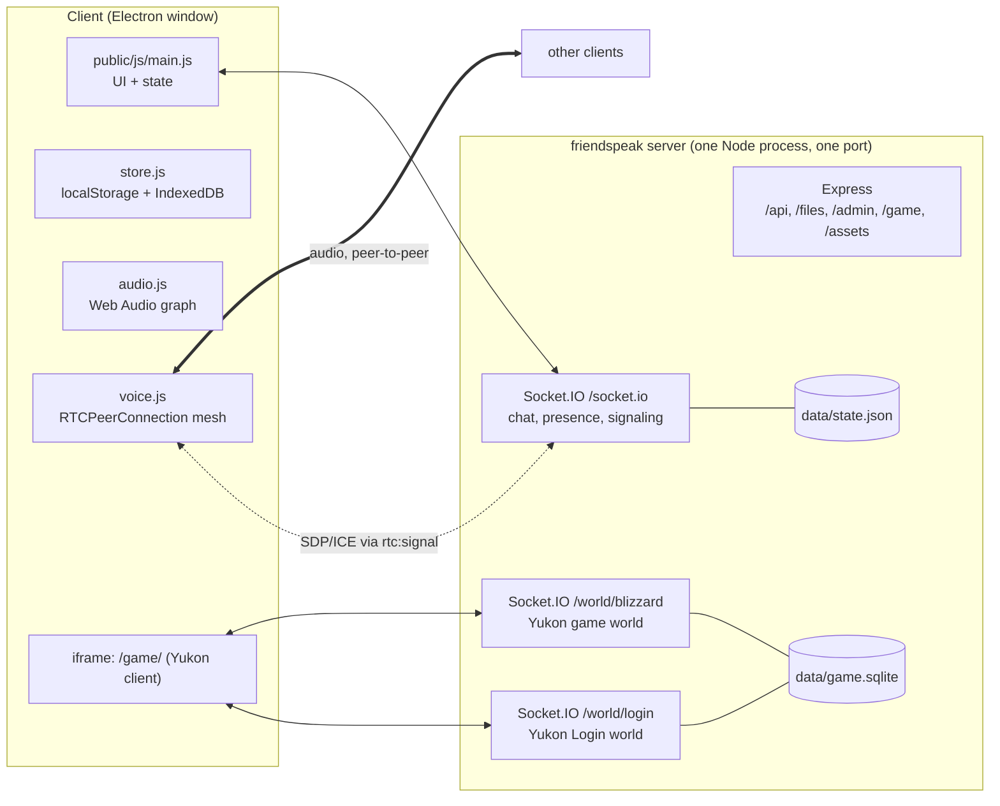
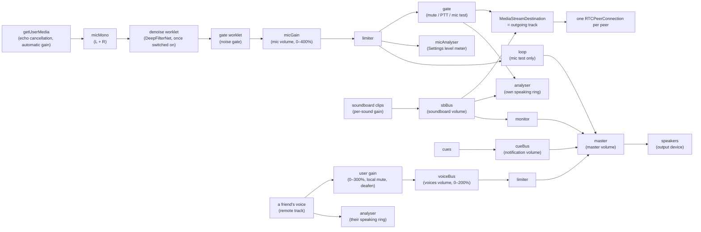
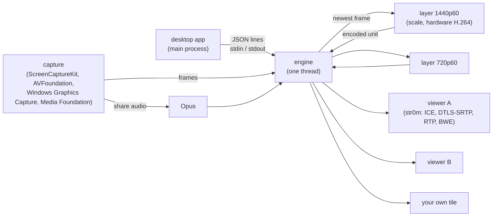

# Architecture

This covers how friendspeak is put together. For *why*, see [DECISIONS.md](DECISIONS.md). For the game, see [GAME.md](GAME.md).

## System overview



**One server process** serves everything on a single port (default 3000):

| Path | Served by | Purpose |
|---|---|---|
| `/` | Express | a plain-text notice; the server hosts no chat UI (D26) |
| `/socket.io/*` | Socket.IO (friendspeak, `serveClient: false`) | chat, presence, voice signaling, game login tokens |
| `/media/<hash>` | Express | an avatar, profile background or emoji by the SHA-256 of its data URL (D58): what apps that say `proto: 2` are sent in place of the picture. `immutable`, `nosniff`, sandboxed; png, jpeg, gif and webp only |
| `/api/info` | Express | `{ name, icon, invite: bool, password: bool, version }`: `invite` says joining takes an invite (D51); `password` is the same value, for apps from before invites |
| `/admin/*` | Express (`admin.js`) | the admin dashboard's files: `admin-ui/`, plus `public/js/util.js` as `/admin/js/util.js` (D34) |
| `/admin/api/*` | Express (`admin.js`) | the dashboard's JSON API and event stream (see "Admin dashboard") |
| `/game/*` | `game/client/dist` | the built Yukon client |
| `/game/friendspeak.js` | `game/index.js` | tells the game client its world paths |
| `/game/lib/*` | `node_modules/phaser/dist` | Phaser 3.80.1 |
| `/game/assets/*` and `/assets/*` | asset dirs (see GAME.md) | game art, crumbs, fonts, SWFs |
| `/world/login` | Socket.IO (Yukon Login world) | penguin login |
| `/world/<world>` | Socket.IO (Yukon game world) | gameplay |

A client can load its UI from **any** friendspeak server (usually its own, on localhost) and connect its socket to **another** server by IP. CORS is `*` for that reason.

## Server (`server.js`)

`startServer(opts) → Promise<{ port, version, https, fingerprint, name, admin: { enabled, local, path, mfa }, game, update, close() }>` is the only export used by callers (plus `lanAddresses()`). Running `node server.js` maps env vars to options (Docker runs the same CLI). The desktop app never runs a server.

### Configuration

| Option (`startServer`) | Env (CLI) | Default | Notes |
|---|---|---|---|
| `port` | `PORT` | 3000 | `0` = any free port |
| `host` | none | all interfaces | |
| `https` | `HTTPS=1` | off | self-signed cert generated into `dataDir` |
| none | `PUBLIC_URL` | none | CLI only: the origin people reach the server at behind a reverse proxy (`https://chat.example.com`). Replaces the LAN addresses and `localhost` in the `Friends connect:` and `Admin dashboard:` lines of the startup output; nothing else reads it. Not an http(s) address → ignored with a line (D53) |
| `dataDir` | `DATA_DIR` | `./data` | `state.json`, `emojis.json`, `profiles/`, `messages/`, `mail/` (see Persistent state), `admin.json`, `admin-audit.log`, `game.sqlite`, `game-secret`, certs, `logs/`, `crashes/` |
| `serverName` | `SERVER_NAME` | `friendspeak` | name for a *new* server only; after that the name in `state.json` wins (renamed from Settings → Server) |
| `giphyKey` | `GIPHY_API_KEY` | none | server-side GIF search |
| `maxStorage` | `MAX_STORAGE` | `2GB` | total bytes of uploaded files; accepts a number or `500MB`/`2GB`-style strings (binary units, `parseSize`) |
| `logs.retentionDays` | `LOG_RETENTION_DAYS` | 14 | days of log history kept in `dataDir/logs`; `0` = memory only (D49) |
| `logs.maxBytes` | `LOG_MAX_SIZE` | `50MB` | size cap of the log history (`parseSize`); oldest files go first |
| `crashReports` | none (the CLI sets it) | off | installs the process-wide `uncaughtException` / `unhandledRejection` handlers and the unclean-exit marker (D49) |
| `game` | `GAME=off` (also `0`/`false`/`no`) | on | `false` = don't serve or start the game at all; clients see it as unavailable, so it can't be switched on in Settings → Server |
| `gameAssetsDir` | `GAME_ASSETS_DIR` (env, read in game/index.js) | none | extra asset folder to search |
| none | `GAME_WORLD` | `Blizzard` | world name; path is `/world/<slug>` |
| none | `GAME_MAX_USERS` | 300 | |
| none | `GAME_SPAWN` | 100 (Town) | `0` = random spawn room (upstream default) |
| none | `GAME_DEBUG=1` | off | logs every Yukon packet |
| `admin.enabled` | `ADMIN=off` (also `0`/`false`/`no`) | on | `false` = the dashboard isn't mounted at all (D34) |
| `admin.local` | `ADMIN_LOCAL=off` (also `0`/`false`/`no`) | on; off when `PUBLIC_URL` is set | `false` = even a request from this machine needs a key. The Docker image sets `ADMIN_LOCAL=off`. With `PUBLIC_URL` set there is a reverse proxy, so the CLI turns it off unless `ADMIN_LOCAL=on` asks for it |
| `admin.key` | `ADMIN_KEY` | none | an admin key from the environment (16+ characters, shorter is ignored with a log line). While set, the generated first-boot key stops working |
| `admin.mfa` | `ADMIN_MFA=off` (also `0`/`false`/`no`) | on | `false` = a key alone signs in; no TOTP setup, no code (D52) |
| `admin.path` | `ADMIN_PATH` | generated | the dashboard's path: one segment of letters, digits, `-`, `_`, `.`, `~` (up to 64) that isn't `api`, `files`, `game`, `assets`, `world` or `socket.io`; anything else is ignored with a log line. Unset = `/admin-` + 32 hex characters, made once and kept in `admin.json`. `false` (`ADMIN_PATH=off`, also `0`/`false`/`no`) = `/admin` (D52) |
| `update.mode` | `AUTO_UPDATE` | `off` | `notify` = check GitHub Releases and tell clients; `on` = also install at the maintenance window (Docker only, needs `WATCHTOWER_TOKEN`; otherwise falls back to `notify`). The admin dashboard can override it at runtime; the override is saved in `state.json` and wins over the variable until it is reset. See "Updates" below |
| `update.cron` | `MAINTENANCE_CRON` | `0 6 * * 0` | 5-field cron in local time (`TZ`): when an update is installed. Invalid → default. The admin dashboard can override it the same way |
| `update.warn` | `MAINTENANCE_WARN` | `24h` | how long before the window clients show the warning (`90m`, `2d`, seconds) |
| `update.repo` | `UPDATE_REPO` | `nickolaiposs/friendspeak` | where releases are checked |
| `update.token` | `GITHUB_TOKEN` | none | needed while the repo is private |
| `update.watchtowerUrl` / `update.watchtowerToken` | `WATCHTOWER_URL` / `WATCHTOWER_TOKEN` | `http://watchtower:8080` / none | the sidecar that replaces the container |
| `update.inDocker` | `FRIENDSPEAK_DOCKER=1` | set by the Dockerfile | gates `AUTO_UPDATE=on` |

### Persistent state

The server keeps one `state` object in memory and saves it in pieces (D57), each a JSON file of its own:

| File | What | Marked as changed by |
|---|---|---|
| `data/state.json` | everything in `state` but the three pieces below, plus `format: 2` | `save()` |
| `data/profiles/<name>.json` | `{ id, profile }`: one of `state.profiles` | `saveProfile(profileId)` |
| `data/messages/<name>.json` | `{ id, messages }`: one text channel's `state.messages[channelId]` | `saveMessages(channelId)` |
| `data/emojis.json` | `state.emojis` | `saveEmojis()` |
| `data/seen.json` | `{ [profileId]: seen }`: when each profile was last online (D58) | `saveSeen()` |
| `data/mail/<name>.json` | `{ id, box }`: one DM mailbox (see Direct messages) | `saveMail(address)` |

`<name>` is the id when it is 8 to 64 lowercase hex characters (the ids this server makes), else `x` and 40 hex characters of its SHA-256: profile ids come from clients, and may hold anything. Each file says its own `id`; one that can't be read, or isn't named after its id, is skipped with a warning.

`persist.js` does the writing. A `save…()` call only marks its piece; 500 ms after the first mark every marked piece is written with `fs.promises` (to `.tmp`, then renamed), so the event loop is held only for the `JSON.stringify` of that piece. A piece that changes while it is being written is written again after. A piece whose data is gone (a member removed, a channel deleted, an empty mailbox dropped) has its file removed. A failed write is logged (once a minute) and tried again with the next write. `close()` waits for the writes under way and then writes what is still marked, synchronously; so does the crash handler, without the wait. **Code that changes a profile, a message or the emojis must call the matching function: `save()` alone doesn't write them.**

A `state.json` without `format: 2` is from before the split and holds everything. At start it is copied to `state.pre-split.json`, `profiles/` and `messages/` are emptied, every piece is written, and `state.json` is rewritten last, so a start that is cut short does it all again. `mail.json` is split into `mail/` the same way and renamed `mail.pre-split.json`. Both copies can be deleted once the server has run. To go back to a version from before the split, put `state.pre-split.json` back as `state.json` (and `mail.pre-split.json` as `mail.json`): that version reads nothing else. Putting an old `state.json` back on a current server is read as a restore: it replaces the pieces.

`state` itself:

```js
{
  format: 2,                              // D57: the pieces have files of their own
  name, icon /* data: URL, https: URL or '' */, channels: [{ id, name /* may contain emojis, incl. :custom: ones */, type: 'text'|'voice' }],
  messages: { [channelId]: Message[] },   // capped at 500 per channel; saved in messages/
  emojis: [{ name, url /* data: URL */, by }],   // saved in emojis.json
  profiles: { [profileId]: { name, color, avatar, banner, card?, status, seen } },  // last-seen snapshot, for rendering history and profile cards; `card` = public DM keys (D32); saved in profiles/
  bans: [{ id, profileId, name, ip, by, ts }],   // `ip` is '' for a profile-only ban and never sent to clients
  roles: [{ id, name, color /* #rrggbb */, perms: { [key]: bool }, grantable: [roleId] }],  // first = highest (D34, D43). ≤50, name 1 to 32 characters; `perms` only explicit settings
  defaultPerms: { [key]: bool },                 // what everyone gets (D43): view, send and both mention keys by default
  defaultGrantable: [roleId],                    // roles everyone may hand out when defaultPerms.manageRoles is on
  permissionsOn: false,                          // open mode until someone holds an admin role; sticky
  forceMuted: [profileId],                       // force-muted by a moderator (D43)
  updateSettings: { mode?, cron? },              // overrides for AUTO_UPDATE / MAINTENANCE_CRON set in the admin dashboard (D34); only the overridden keys exist; never sent to clients
  inviteOnly: true,                              // D51: joining takes an invite
  invites: [{ id, hash, token, label, maxUses, uses, expires, by: { id, name }, ts, revoked, joins: [{ id, name, ts }] }], // D51: hash = SHA-256 of the token, which looks it up; token: kept so a working invite can be copied again (null: made when only the hash was kept); ≤200; never sent to clients as is
  dmV2: [ed25519PublicKey],                       // D55: keys that have answered the /dm challenge bound to the host; the older answer is refused for them. ≤20000; never sent to clients
  pins: { [profileId]: ed25519PublicKey },        // D42: the key each profile id must sign its hello with; kept when a member is removed; never sent to clients
  memberRoles: { [profileId]: [roleId] },        // only profiles with a role, ≤10 each. Beside `profiles` because storedProfile() rebuilds those on every hello
  files: [{ id, name, size, type, channelId, messageId /* null until attached */, by /* profileId */, byName, ts }]
}
```

Uploaded file contents live in `dataDir/files/<id>` (the id is 128 random bits). See "Files" below.

`Message = { id, author /* profileId */, name, text, gif?: {url,w,h,title}, files?: [{id,name,size,type}], replyTo?, reactions: { [emoji]: profileId[] }, ts, edited? }`

### Files (D24)

1. **Upload:** `POST /api/files?channelId=…`. The raw body is the file. `x-file-name` holds the URI-encoded name, `content-type` the type, and `x-friendspeak-sid` the uploader's socket id, which must have passed `hello` (so the invite applies). Socket ids are sent to every member, so an app that said `uploadKey: true` in its `hello` also sends the key from the ack in `x-friendspeak-upload`, and an upload for that socket without it is refused (401); apps from before that are known by the socket id alone. `Content-Length` is checked against the quota (`MAX_STORAGE` minus stored files minus uploads in flight) *before* reading. The body streams to `files/<id>.part`, then is renamed. Response: `{ ok, file }` or `{ error }` (401/400/413). CORS is `*`, because clients run on other origins (desktop app, other servers) and never send cookies.
2. **Attach:** `msg:send { files: [id…] }` (≤10). Only the sender's own, still-unattached uploads to that channel count. Unattached uploads older than an hour are swept (`sweepFiles`, every 10 min and at start), along with stray `.part` files.
3. **Download:** `GET /files/:id/:name` (`?download` forces `attachment`). Only attached files are served. Images, video, audio and `text/plain` from a fixed allow-list (`INLINE_TYPES`) are inline. Everything else is `attachment` + `application/octet-stream`, so uploaded HTML/SVG can never run on the server's origin (the game client's origin). Every file response has `nosniff` and a `sandbox` CSP. Range requests work (video seeking).
4. **Delete:** `deleteFiles(ids)` removes files from disk and state, and drops them from their message. It deletes the message if nothing is left, and it emits `msg:update`/`msg:deleted` plus `files:deleted`. It also runs when a message with files or a channel is deleted.

The client builds URLs as `${server}/files/${id}/${name}`. The desktop app saves downloads via `desktop.download(url)` (`webContents.downloadURL`, which gives a save dialog and honours pinned certificates).

In-memory only: `users: Map<socketId, { profile, voice, muted, deafened, sharing, camera, playing, since, ip, uploadKey }>`. `since` (when the socket said `hello`) and `ip` (its peer address) are for the admin dashboard, `uploadKey` is the secret for that socket's uploads (null for an app that asked for none); none of them is sent to other clients (`userList()` leaves them out).

### Protocol (Socket.IO, path `/socket.io`)

Every event except `hello` requires a successful `hello` first. `on()` inside `attach()` enforces that, wraps handlers in try/catch, and supplies a no-op `ack` when the client didn't ask for one.

`guard()` runs for every socket of both namespaces before its handlers exist. It catches what any handler throws (a payload of the wrong shape must never reach the process's crash handler) and rate limits events per socket: a budget of 400 that refills at 40 a second, where most events cost 1 and the heavy ones more (`EVENT_COST`: `hello` 20, `profile:update` 40, `msg:send` 4, …). An event over the budget is dropped, and acked `{ error: 'Too many requests, slow down' }` if it asked for an ack.

**Client → server**

| Event | Payload | Ack | Effect |
|---|---|---|---|
| `hello` | `{ profile, invite?, password?, proof?, uploadKey?, proto? }` (`invite`: the token of someone joining, D51; apps from before invites send it as `password`; `uploadKey: true` asks for a key for uploads, returned as `uploadKey` in the ack; `proto: 2`: the app takes pictures by reference and the small events, see "Pictures and presence" below) | `{ ok, sid, server: { id, name, icon, channels, emojis, profiles, bans, roles, memberRoles, defaultPerms, defaultGrantable, permissionsOn, forceMuted, inviteOnly, game, update }, users, perms }` or `{ error, banned?, key?, invite? }` (`invite: true`: a working invite is needed) | refused if the profile id or IP is banned. **Key (D42):** `proof` is the profile's Ed25519 signature (base64url) over `friendspeak-hello-v1\|<socket id>\|<host>`, by the key in `profile.card` (which must be self-signed). `host` is `new URL(serverAddress).host` and must equal the `Host` header. The first proven key for a profile id is pinned in `state.pins`; later hellos need a proof by that key (`key: true` on refusal). Without `proof` (apps from before D42) a hello is accepted only for an id with no pin. `profile:update` can't change the card. Registers the socket; broadcasts `users`, and `profile` when it differs from the stored one in more than `seen`. **One session per profile:** any older socket with the same profile id is taken out of voice (`voice:peer-left`), sent `session:replaced` and disconnected. A reconnect after a network drop therefore never shows the person twice, even though the dead socket would otherwise linger until its ping timeout (~45 s). The replaced client doesn't auto-reconnect; it shows a message instead. |
| `server:update` | `{ name?, icon?, game?, audioQuality?, inviteOnly? }` (`inviteOnly`: whether joining takes an invite, administrators only, never open mode. `icon: ''` removes it; ≤512KB data image or an https link. `game: true/false` switches the game on or off; switching it on is refused while the game isn't available, e.g. assets missing. `audioQuality`: `low`, `standard`, `high` or `max`, the voice bitrate in this server's channels, D38) | `{ ok }` / `{ error }` | admin only (anyone in open mode). `server { name, icon, game, audioQuality }` (and `users` when the game is switched off) |
| `profile:update` | profile | none | `profile`, `users` (nothing when it changes nothing) |
| `msg:history` | `{ channelId, before? }` | `{ messages }` (≤50, oldest first; empty without `view`) | none |
| `msg:send` | `{ channelId, text?, gif?, replyTo?, files?: fileId[] }` | `{ ok }` / `{ error }` | needs the channel's `send`. `msg:new` to the channel's viewers; `files:new` if files were attached. The server finds mentions (`@everyone` with `mentionEveryone`, `@role` with `mentionRoles`, `@name`, longest name wins, code ignored, a reply mentions its author) and stores `message.mentions = { users?: [profileId], roles?: [roleId], everyone?: true, spans?: [[at, length, kind, id]] }` only when there are any. `spans` are positions in `text`, so clients draw each mention with today's name. `@name#tag` (tag from `mentionTag(profileId)`) picks one of several people with the same name, and an untagged shared name mentions all of them; it also pushes `mention` over `/dm` (D41) to mentioned profiles that can view the channel. `#name` of a text channel the sender can view (same matching rules) is stored as `message.channels = [[at, length, channelId]]`, so the link follows a rename (D54) |
| `msg:edit` | `{ channelId, messageId, text }` | none | `msg:update` (author only, with `send`); `mentions` and `channels` are recomputed, with no new `mention` push |
| `msg:get` | `{ channelId, messageId }` | `{ message: { id, channelId, channelName, author, name, text (≤300 chars), ts, gif?: true, files?: count } }` / `{ error: 'unavailable' }` | none. The preview of a linked message (D54). Needs the channel's `view`; a missing message and a channel that can't be read get the same answer |
| `msg:search` | `{ q? (≤100 chars), channelId?, from?: [profileId], before?, after? (times: `ts < before`, `ts >= after`), has?: ['file' \| 'image' \| 'gif' \| 'link'] }` (a query, a filter, or both) | `{ results: [{ channelId, id, author, name, ts, text, file? }], more }` (≤50, newest first) | none. Case-insensitive match on message text and file names, in the text channels the profile can `view` (or the one), narrowed by the filters (several `from` are either-or, several `has` are all-of). `text` is cut to the lines around the match; `file` is the file name that matched. The query is never logged. Servers from before it don't answer: the app gives up after 8 s |
| `msg:delete` | `{ channelId, messageId }` | `{ ok }` / `{ error }` | `msg:deleted`. The author, or anyone with `manageMessages` who can view the channel |
| `msg:react` | `{ channelId, messageId, emoji }` | none | toggles (needs `send`); `msg:update` |
| `typing` | `{ channelId }` | none | `typing` to others who can view the channel |
| `channel:create` | `{ name, type }` (≤48 chars; emojis allowed, `:custom:` ones render as images) | `{ ok, channel }` / `{ error }` | needs `manageChannels`; `channels`, `perms` |
| `channel:rename` / `channel:delete` | `{ id, name? }` | `{ ok }` / `{ error }` | needs the channel's `manage`; `channels` (the last channel of a type can't be deleted) |
| `channel:perms` | `{ id, overrides: { [roleId \| 'everyone']: { view?, send?, manage? } } }` (the whole new set) | `{ ok }` / `{ error }` | needs the channel's `manage`; `perms` and filtered `channels` to everyone |
| `emoji:add` | `{ name, url }` | `{ ok }` / `{ error }` | needs `manageEmojis`; `emoji:added { emoji }` (`proto: 2`) or `emojis` |
| `emoji:remove` | `{ name }` | `{ ok }` / `{ error }` | needs `manageEmojis`; `emoji:removed { name }` (`proto: 2`) or `emojis` |
| `file:list` | `{ channelId? }` (omit for the whole server) | `{ files, storage: { used, max } }` (attached files in channels you can view, newest first) | none |
| `file:delete` | `{ ids: fileId[] }` | `{ ok }` / `{ error }` | your own files, or any with `manageFiles` in channels you can view (all or nothing); `msg:update`/`msg:deleted`, `files:deleted` |
| `gif:search` | `{ q }` | `{ data }` / `{ error: 'nokey' \| msg }` | none |
| `voice:join` | `{ channelId }` | `{ ok, peers: socketId[] }` / `{ error }` | needs the channel's `send`; leaves the previous channel; `users` |
| `voice:leave` | none | none | `voice:peer-left` to the room; `users` |
| `voice:state` | `{ muted, deafened }` | none | `users` (`muted` stays true while force-muted, unless they have `forceMute`) |
| `voice:kick` | `{ profileId }` | `{ ok }` / `{ error }` | needs `voiceKick`; not on admins or yourself. Target gets `voice:kicked { reason: 'kicked', by }`; `users` |
| `voice:forcemute` | `{ profileId, muted }` | `{ ok }` / `{ error }` | needs `forceMute`; not on admins. Sets or clears the flag in `state.forceMuted` (never touches the person's own mute); you can only lift your own. Target gets `voice:forcemuted { muted, by }`; `users` |
| `voice:media` | `{ screen, camera }` (booleans) | none | `users` (each user has `sharing` and `camera`; both cleared on leaving voice) |
| `rtc:signal` | `{ to, data }` | none | relayed only if both are in the same voice channel. The app takes a call only from a socket that `users` lists in its voice channel (`isPeer` in `voice.js`), so nobody it can't see in the channel is sent its voice. `data` is `{ sdp }`, `{ candidate }`, or media control: `{ watch: 'screen'\|'camera', on }` and `{ view: kind, w, h, hidden }` (viewer → sender: displayed size in device pixels, or window hidden) and `{ media: 'screen'\|'camera', id: streamId \| null }` (sender → viewer). Native streams (D45) add `stream: 1` to `watch` and `media`, and `{ stream: kind, sdp \| candidate }` (sharer → viewer) and `{ viewing: kind, sdp \| candidate }` (viewer → sharer); see Native streaming |
| `game:login` | none | `{ ok, username, token, path }` / `{ error }` | creates the penguin on first use and renames it when the profile name has changed (GAME.md). Refused while the game is unavailable or switched off. |
| `game:state` | `{ playing }` | none | `users` |
| `member:remove` | `{ profileId }` | `{ ok }` / `{ error }` | needs `kick`; not on admins or yourself (D27, D43). Their chat and DM-signaling sockets get `removed` and are disconnected, and their stored profile and role assignments are deleted: `profile:removed {id}`, `users`. They are no longer a member: coming back takes an invite (D51). |
| `server:leave` | `{}` | `{ ok }` | The app sends it when the server is removed from its list. The caller's chat and DM-signaling sockets get `left` and are disconnected, and the membership ends as in `member:remove`: `profile:removed {id}`, `users`. Coming back takes an invite (D51). |
| `ban:add` | `{ profileId, ip? }` | `{ ok, ipSkipped }` / `{ error }` | needs `ban`; not on admins or yourself (D27, D43). The target's chat and DM-signaling sockets (and, with `ip`, every socket from their last IP) get `banned` and are disconnected, and the membership ends as in `member:remove`, so after an unban they need an invite (D51); `bans`, `profile:removed {id}`, `users` |
| `ban:remove` | `{ id }` | `{ ok }` / `{ error }` | needs `ban`; `bans`. A ban from before bans ended membership ends it now. |
| `role:create` | `{ name, color, perms?, grantable? }` | `{ ok, role }` / `{ error }` | needs `manageRoles`; only admins may set `perms`/`grantable`. `roles`, `perms` |
| `role:update` | `{ id, name?, color?, position?, perms?, grantable? }` (`perms` replaces the role's set; `null` = inherit) | `{ ok, role }` / `{ error }` | non-admins only rename/recolor roles without permissions; `roles`, `perms` |
| `role:delete` | `{ id }` | `{ ok }` / `{ error }` | non-admins only roles without permissions; drops it from members, grantable lists and channel overrides |
| `member:roles` | `{ profileId, roles: roleId[] }` (the full new list) | `{ ok, roles }` / `{ error }` | non-admins may only add/remove roles in their `grantable` set that carry no permissions, never on an admin; roles with permissions need a pinned key (D42) |
| `invite:list` | `{}` | `{ ok, invites, inviteOnly }` / `{ error }` | needs `createInvites` (D51). Invites as in `GET /admin/api/invites`. `token` is set on a working invite for an administrator, and on the caller's own for anyone else; otherwise `null` |
| `invite:create` | `{ label?, maxUses?, expiresIn? }` | `{ ok, invite, token }` / `{ error }` | needs `createInvites`. `invite.token` (and `token`, the same) is the new token |
| `invite:remove` | `{ id }` | `{ ok, revoked }` / `{ error }` | needs `createInvites`; someone else's invite: admin only. A working invite is revoked and stays listed, a dead one is removed |
| `invites` (server → client) | `{ invites }` | | sent only to sockets with `createInvites`, when an invite is made, used, revoked or removed; tokens as in `invite:list`, per socket |
| `perms:default` | `{ perms?: { key: bool }, grantable?: roleId[] }` | `{ ok, defaultPerms, defaultGrantable }` / `{ error }` | admin only |

A profile may carry `card` (`{ id, s, d, sig }`, the public keys for DMs, D32). The server checks its shape and that `id` is the profile's id, stores it and passes it on; clients verify the signature. `users` entries carry the profile minus `banner` (the list is re-broadcast on every mute toggle). Clients read backgrounds from `profiles` and keep it current with `profile` events.

**Server → client:** `users`, `profile`, `server`, `channels`, `emojis`, `msg:new`, `msg:update`, `msg:deleted`, `files:new {files, storage}`, `files:deleted {ids, storage}`, `typing`, `rtc:signal {from, data}`, `voice:peer-left {sid}`, `voice:kicked { reason: 'deleted' \| 'kicked' \| 'perms', by? }` (you're out of voice), `voice:forcemuted { muted, by }`, `perms` (your effective permissions changed), `session:replaced` (the same profile connected again elsewhere; followed by a server-side disconnect), `bans` (the list, without IPs), `roles { roles, memberRoles, defaultPerms, defaultGrantable, permissionsOn }` (any changed), `banned` / `removed` / `left` (each followed by a server-side disconnect), `profile:removed {id}`, `server:update` (the `update` object below changed). A `profile` event also goes out when someone disconnects, carrying their new `seen` time.

**Pictures and presence (D58).** An app that sends `proto: 2` in `hello` is put in the room `proto:2`, any other in `proto:1`, and the two are sent different things:

| | `proto:1` (apps from before D58) | `proto:2` |
|---|---|---|
| avatars and backgrounds in `server.profiles`, `profile` and `users`, emoji `url`s | the data URL | `/media/<hash>`: the app puts the server's origin in front (`mediaResolver()` in `util.js`) and loads it over HTTP, once |
| someone disconnects | `profile` (whole, for its `seen`) | `profile:seen { id, seen }` |
| an emoji is added or removed | `emojis` (the whole set) | `emoji:added { emoji }` / `emoji:removed { name }` |

A picture that isn't a data URL (an emoji as avatar, a GIPHY address, a color) is sent as it is to both. In `state` and on disk pictures are still data URLs; `refOf()` hashes one the first time it is sent and `GET /media/<hash>` decodes it. A picture nobody has any more stops being served within ten minutes. Connecting with the profile the server already has sends no `profile` to anyone and writes only `seen.json` (`{ [profileId]: seen }`, read over the profiles' own `seen` at start).

**Permissions (D43).** `roles` entries are `{ id, name, color, perms, grantable }` (first = highest). `perms` holds only explicit settings (`true`/`false`; `admin` only `true`), `grantable` the roles a holder of `manageRoles` may hand out. `defaultPerms` has every key: `admin`, `view`, `send`, `mentionRoles`, `mentionEveryone`, `kick`, `voiceKick`, `ban`, `forceMute`, `manageRoles`, `manageChannels`, `manageEmojis`, `manageFiles`, `manageMessages`, `createInvites` (D51: off by default, and off in open mode like `manageRoles`). Channels may carry `overrides { [roleId | 'everyone']: { view?, send?, manage? } }`. `permsOf(profileId)` in `server.js` resolves them: open mode (`permissionsOn` false) allows everything but role management; an admin (role or default) gets everything; otherwise the highest held role that sets a key wins, else the default; per channel a held role's override wins, then everyone's, then the server-wide value, and `send`/`manage` need `view`. Roles with permissions don't count for profiles without a pinned key. The `perms` object (hello ack and `perms` event) is `{ open, admin, ...keys, grantable, channels: { [channelId]: { view, send, manage } } }`, with only visible channels. The app opens Server settings only for `open`, `admin` or any of the moderation and management keys (`canSeeServerSettings()` in `main.js`). `channels` and `users` go out per socket (hidden channels left out, `voice` nulled for a hidden voice channel), and `msg:new`, `msg:update`, `msg:deleted`, `typing` and `files:new` only to sockets that can view the channel. `permsChanged()` is the one place that re-sends `roles`, `perms` and `channels` and takes people out of voice channels they lost. `permsOf()` keeps its answer per profile, frozen, until `permsStale()`: `permsChanged()` calls it, and so does anything else that changes what it reads (a key pinned or reset, a member or a channel gone). `users` is built once per group of sockets that see the same of the occupied voice channels, which is one group unless one of those channels is hidden from somebody. `users` entries carry `forceMuted`. All of this is optional (D29): an app on an older server gets no `perms` and allows everything, and an older app on this server gets refusals and filtered lists.

Stored profiles (`server.profiles`) carry `status` and `seen` (last time online). The member list shows every stored profile that isn't online or banned under **Offline**.

`server.update` (`updater.js` → `info()`): `{ version, mode, cron, changelog, latest: { version, url } | null, at, warnFrom, finalFrom, installing }`. `mode` is the effective mode and `cron` the active schedule, and both can change while the server runs (an admin sets them in the dashboard); clients are told with `server:update`. `at` is the scheduled install time (ms) in `on` mode (or for an install requested from the dashboard), otherwise null. `GET /api/info` also returns `version`.

### Updates (`updater.js`, D29)

With the update mode `notify` or `on` (from `AUTO_UPDATE`, or set in the dashboard), the server asks the GitHub API for the latest release 30 s after start and then every 6 h. When a newer version appears in `on` mode, it schedules the install for the first cron match at least 10 min away, then broadcasts `server:update`. Clients show a closeable warning from `warnFrom` on. If it was closed, it shows again from `finalFrom` (10 min before). At `at`, the server broadcasts `installing: true` and sends `POST /v1/update` (bearer `WATCHTOWER_TOKEN`) to the Watchtower sidecar. Watchtower pulls `:latest`, stops this container (SIGTERM → normal shutdown) and starts the new one, and clients reconnect on their own. If the process is still alive 15 min later, the update counts as failed and is rescheduled for the next window (in `notify` mode, where nothing is scheduled, the time is just cleared). A window is only scheduled when Watchtower answers HTTP (any status) at check time. Without it, or without `WATCHTOWER_TOKEN`, `on` acts like `notify`. In the compose file Watchtower is opt-in (`COMPOSE_PROFILES=autoupdate`). `npm start` installs never install anything: `on` degrades to `notify`.

**Mode and window at runtime (admin dashboard, D34).** `createUpdater` takes the environment values (`mode`, `cron`) and `overrides` (`{ mode?, cron? }`, from `state.updateSettings`; a malformed value is ignored with a log line). `derive()` is the only place that works out `requestedMode` (override, else environment), the effective `mode` (`on` falls back to `notify` without Docker or `WATCHTOWER_TOKEN`) and the active `cron`. `configure({ mode, cron })` sets an override with a value, removes it with `null` and leaves it alone with `undefined`. It changes nothing if a value is invalid (`Mode must be off, notify or on`, `Invalid schedule: <reason>`), and is refused while installing (`An update is being installed`). `admin.js` saves `overrides()` to `state.json` afterwards. Effects: switching to `off` stops checks and clears `latest`, `at` and a requested install; switching from `off` runs a check at once; to effective `on` with a newer version known, a window is scheduled once Watchtower answers; away from `on`, a scheduled window is cleared. A new `cron` moves a scheduled window to the next run of the new schedule, at least 10 minutes away. An install requested with Update now is never moved or cleared by these. `preview(cron)` returns the next three runs and changes nothing. `status()` also has `requestedMode`, `env: { mode, cron }`, `overridden: { mode, cron }`, `nextWindow` and `tz`.

**Update now (admin dashboard, D34).** `updater.status()` is `info()` plus `lastCheck`, `lastError`, `watchtower`, `canInstall` and `manual`. `canInstall` is true in Docker with a Watchtower token, whatever `AUTO_UPDATE` says, so a host on `notify` with the sidecar can update from the dashboard. It is never true outside Docker. `installSoon(delay = 2 min)` refuses unless a newer version is known, `canInstall` holds and Watchtower answers a probe. Then it sets `at` to now + `delay`, sets `manual`, and broadcasts `server:update`. Clients already show their warning when `at` is less than 10 minutes away, so nothing changes in the app. At `at` the normal install runs. `cancelInstall()` only works on a requested install that hasn't started: in `on` mode the update goes back to the next cron window, in `notify` mode `at` becomes null. `checkNow()` runs a check now (an error when `AUTO_UPDATE` is off); concurrent checks share one run. A failed install in `notify` mode clears `at` instead of rescheduling.

### Admin dashboard (`admin.js`, `admin-ui/`, D34, D52)

A web page served by the server itself, with a JSON API and one event stream behind it. `createAdmin(ctx)` in `admin.js` mounts it from `startServer()` and returns `{ path, mfa, notify(topic), close() }`. With `ADMIN=off` it isn't created.

**Where (D52).** The dashboard lives at `path`: by default `/admin-` + 32 hex characters (16 random bytes), made on the first start, kept as `path` in `admin.json` and printed by the CLI at every start. `ADMIN_PATH` names another, or `off` for `/admin`. Below, `/admin` in a route stands for that path. The path is registered with the log scrubber (`logs.redact`), so the stored log and the dashboard's log view never hold it; the process's stdout does. When the path isn't `/admin`, a request to `/admin` that is local (next paragraph) gets a 302 to the real path, and any other gets the 404 of an unknown path.

**Who may open it.** A request is **local** when the peer address is loopback, the `Host` is `localhost`, `127.0.0.1` or `[::1]`, nothing says a reverse proxy passed it on (`PROXY_HEADERS` in `admin.js`: `X-Forwarded-*`, `Forwarded`, `X-Real-IP`, `Via` and the like, or HTTP/1.0, which nginx speaks to what it proxies), and `ADMIN_LOCAL` isn't off. Local requests need no key. Every other request needs a session from an admin key (and its code, below), and a key is only accepted over TLS (`req.secure` or `X-Forwarded-Proto: https`) or on a direct loopback connection. `canLogin` in the session reply says which. Forwarded headers are never used to pick an address.

**Keys.** `DATA_DIR/admin.json` (mode 0600) holds `{ path?, keys: [{ id, name, hash, created, lastUsed, bootstrap?, totp? }], envTotp? }`, where `hash` is the SHA-256 of the key (`fsa_` + 32 random bytes, base64url). Keys are compared in constant time against every active key. With no stored key and no `ADMIN_KEY`, the first start makes one named "First-boot key" and prints it once on stdout, not through `console`, so it never reaches the log buffer. `ADMIN_KEY` becomes a key with id `env`, which can't be revoked in the dashboard, and the first-boot key stops being active. At most 50 stored keys.

**2-step sign-in (D52).** TOTP as in RFC 6238 (SHA-1, 6 digits, 30 s), done with `node:crypto`. Each key has its own secret (20 random bytes, base32), stored in clear as `totp: { secret, last }` on the key; the `ADMIN_KEY` key's is `envTotp: { secret, last, hash }` and counts only while `hash` is that of the current `ADMIN_KEY`, so a changed `ADMIN_KEY` sets up again. `login` with a right key and no `code` answers `200 { mfa: 'setup', secret, uri, expired }` when the key has no secret yet (a pending secret is made and kept in memory for 10 minutes; `uri` is the `otpauth://totp/friendspeak:<server name> (<key name>)?secret=…&issuer=friendspeak` the page draws as a QR code; `expired` says a code arrived after the pending secret was gone), or `200 { mfa: 'code' }` when it has one. Neither makes a session. The page then sends `{ key, code }`: a right code for the pending secret stores it and signs in; for a stored secret it signs in. A code is accepted for the current 30 s step and the one on either side, and only for a step newer than `last`, so a code works once. A wrong code is a failed sign-in for the address (below) and is also counted per key: five free, then that key's codes are refused for 30 s, doubling up to 1 h (`429`). `POST keys/:id/mfa/reset` drops a key's secret. With `ADMIN_MFA=off` none of this runs: stored secrets are kept and ignored. Local requests never need a code. `admin-ui/js/qr.js` is the QR encoder (byte mode, level L, versions 1 to 20), written for this page because the CSP allows no other origin and there is no build step.

**Sessions.** A successful `login` makes a random token and sets the cookie `fs_admin` (`HttpOnly; SameSite=Strict; Path=<the dashboard's path>`, plus `Secure` on TLS). Only the token's SHA-256 is kept, in memory, with its key id, so restarts end all sessions. A session ends 12 h after sign-in or after 1 h idle, whichever comes first, or when its key is revoked. An open event stream counts as activity (the 12 h limit still applies).

**Cross-site rules.** Every API request with `Sec-Fetch-Site: cross-site` or `same-site` is refused (403). `POST`, `PUT`, `PATCH` and `DELETE` also need `Content-Type: application/json` and an `Origin` whose host equals the request's `Host` header, so behind a reverse proxy the original `Host` has to be passed on. These checks apply to local requests too. There is no CORS on `/admin`.

**Rate limit.** Per IP, five failed sign-ins are free. Then the address is locked out for 30 s, doubling per failure up to 1 h (`429` with `retryAfter` and a `Retry-After` header). More than 100 failures in 10 minutes from any address also lock sign-in for 60 s, but only for addresses that already have a failure on record. Behind a proxy every request has the proxy's address, so the lockouts are shared.

**Response headers.** Every `/admin` response has the CSP `default-src 'self'; img-src 'self' data: https:; style-src 'self'; script-src 'self'; connect-src 'self'; frame-ancestors 'none'; base-uri 'none'; form-action 'self'`, `X-Frame-Options: DENY`, `X-Content-Type-Options: nosniff`, `Referrer-Policy: no-referrer` and `Cache-Control: no-store`. The dashboard's HTML therefore has no inline scripts, styles or `style` attributes. Setting styles from JS (what `h()` does) is fine.

**Audit log.** `audit(actor, ip, action, detail)` appends a JSON line to `DATA_DIR/admin-audit.log` and rotates it to `.1` at 5 MB. The IP is the peer address.

**Log (D49).** `logbuffer.js` wraps `console.log/info/warn/error/debug` once at startup (`startServer` option `captureLogs: false` skips it). Output still goes where it did. Each call is also kept as `{ id, ts, level, source, text }` (text cut at 4096 characters, ANSI codes removed, `source` the lowercased leading `[tag]`). `id` is `max(last + 1, Date.now() * 1000)`: unique, rising across restarts, and never below `ts * 1000`, which lets a search skip whole files.

- **Scrubbing.** Before a line is kept anywhere, `scrub()` replaces the secrets registered with `redact()` (the GIPHY key, `ADMIN_KEY`, the GitHub and Watchtower tokens; 6+ characters), `fsa_…` admin keys, base64 data URIs, invite tokens, `Bearer` tokens and `password`/`token`/`key`-style values (`token=…`, and `token: '…'` or `"token":"…"` as a logged object or JSON prints them) with `[redacted]`. The console gets the same treatment, since it is what `docker logs` keeps: a line that holds one of these is printed scrubbed, any other line as it was. One thing is scrubbed from what is stored but not from the console: the dashboard's path (`redact(path, { storedOnly: true })`), which the host reads there (D52). The first-start invite and admin key are written to stdout directly and are not touched.
- **Memory.** A ring of the last 2000 lines feeds the event stream and its replay.
- **Disk.** Every line except `debug` is appended as a JSON line to `DATA_DIR/logs/server-YYYY-MM-DD-NN.log` (UTC day, mode 0600; a new part `NN` past 5 MB). Writes are queued and flushed once a second; `flushSync()` runs on exit, on `close()` and in a crash. Files older than `LOG_RETENTION_DAYS` are deleted, then the oldest while the total is over `LOG_MAX_SIZE` (at start, hourly and when a file is started). `query()` reads the files newest first and stops when it has enough; with `LOG_RETENTION_DAYS=0` it answers from the ring.
- **What is logged.** `[auth]` refused sign-ins (no valid invite with the peer address, bans, key pinning) and first joins; `[server]` start, shutdown, connects and disconnects, settings changes, failed saves; `[mod]` bans, removals, roles, permissions, channels, voice kicks, force mutes, other people's messages deleted; `[files]` refused and failed uploads, other people's files deleted; `[socket]` and `[http]` handler errors; `[crash]`; and `[admin]`, `[game]`, `[update]` as before. People appear as `Name (first 8 of the id)`. `[voice]` joins and leaves and the `GAME_DEBUG` packet dump are `debug`: live only.

**Crash reports (D49).** `crashlog.js` writes one JSON file per event to `DATA_DIR/crashes/<id>.json` (id `YYYYMMDD-HHMMSS-xxxx`, mode 0600, the newest 100 kept), synchronously: `{ id, ts, kind, fatal, message, stack, version, node, platform, arch, uptime, memory: { rss, heapUsed }, online, docker, lines }`, where `lines` is the last 200 log lines. With `crashReports` on (the CLI):

| `kind` | When | Then |
|---|---|---|
| `uncaughtException` | an error nothing caught | report, write the pieces of the state and the mail that are waiting, flush the log, exit 1 |
| `unhandledRejection` | a promise nobody handled | report (one per `name: message` a minute), keep running |
| `startup` | `startServer` failed (port in use, …) | report, exit 1 |
| `unclean-exit` | at boot, `logs/.running` (`{ pid, startedAt, version }`) is still there and that process isn't alive | report with the previous run's last stored lines, `startedAt` and `previousVersion`; `uptime`, `memory` and `online` are null |

`close()` and a reported crash remove the marker, so only a kill, an out-of-memory kill or a power loss leaves it.

**Change hints.** `admin.notify(topic)` tells open event streams that something changed, after a 250 ms delay that merges bursts. `server.js` calls it from `save()` and the other `save…()` functions (`state`), `broadcastUsers()` (`users`) and the updater's `onChange` (`update`); `admin.js` itself sends `keys`, and `crashes` when a report is written or deleted.

**Routes** (all JSON; errors are `{ error }`; `401 { error, login: true }` means no session):

| Route | Auth | Payload / reply |
|---|---|---|
| `GET /admin` | none | 302 to `/admin/` |
| `GET /admin/`, `/admin/admin.css`, `/admin/js/**` | none | the dashboard's files |
| `GET /admin/api/session` | none | `{ authed, local, actor, tls, canLogin, mfa, fingerprint, name, version }`. `mfa`: 2-step sign-in is on. `actor` is the key's name, `"local"` or null. `fingerprint` is the server certificate's, or null when the server isn't serving HTTPS |
| `POST /admin/api/login` | none | `{ key, code? }` → `{ ok, actor }` and the cookie, or `{ mfa: 'setup', secret, uri, expired }` / `{ mfa: 'code' }` when a code is needed first (above). 401 wrong key or wrong code, 429 locked out, 400 when `canLogin` is false |
| `POST /admin/api/logout` | session | `{ ok }`; clears the cookie, the session and its event streams |
| `GET /admin/api/overview` | session | `{ name, icon, version, startedAt, uptime, node, platform, memory: { rss, heapUsed }, docker, https, fingerprint, inviteOnly, invites (how many still work), adminLocal, adminMfa, adminPathHidden, counts: { online, profiles, bans, channels }, storage: { used, max }, game, update, crashes: { count, last }, logs }`. `logs` is the `logs/info` reply. `game` is the `game` object clients get, `update` is `updater.status()` |
| `GET /admin/api/logs?before=<id>&limit=<n>&q=&level=&source=&from=<ms>&to=<ms>` | session | `{ lines: [{ id, ts, level, source, text }], more }`, oldest first, from the stored history: the newest `limit` (default 500, max 2000) matching lines, or with `before` those just older than that id. `q`: case-insensitive text; `level`: comma list of `debug`, `info`, `warn`, `error` (history has no `debug`); `source`: a tag, or `-` for lines without one; `from`/`to` inclusive. `more`: older matches exist |
| `GET /admin/api/logs/info` | session | `{ persisted, bytes, files, oldest, retentionDays, maxBytes }`; `oldest` is the first stored line's time or null |
| `GET /admin/api/logs/export?<the same filters>&limit=<n>` | session | a `text/plain` attachment `friendspeak-log-<time>.txt`: a header, then `<ISO time> <LEVEL> <text>` per line. `limit` defaults to 20000 (max 100000) |
| `GET /admin/api/crashes` | session | `{ crashes: [{ id, ts, kind, fatal, message, version }] }`, newest first |
| `GET /admin/api/crashes/:id` | session | the report (above). 404 `No such crash report`, also for a malformed id |
| `DELETE /admin/api/crashes/:id`, `DELETE /admin/api/crashes` | session | `{ ok }` / `{ ok, removed }`; audited as `crash.delete` / `crash.clear` |
| `GET /admin/api/events` | session | Server-Sent Events, below |
| `GET /admin/api/keys` | session | `{ keys: [{ id, name, created, lastUsed, env, bootstrap, active, current, mfa }], mfa }`. `current` is the key this session signed in with; a key's `mfa` says it has set up 2-step sign-in, the outer `mfa` that the server asks for it |
| `POST /admin/api/keys` | session | `{ name }` (1 to 40 characters) → `{ ok, key, secret }`. The secret is returned this once |
| `DELETE /admin/api/keys/:id` | session | `{ ok }`; its sessions end at once. 400 for the `env` key or an unknown id |
| `POST /admin/api/keys/:id/mfa/reset` | session | `{ ok }`; drops the key's TOTP secret (also the `env` key's), so it sets up again at its next sign-in. Its sessions stay. Audited as `key.mfa.reset`. 400 for an unknown id or a key without one |
| `GET /admin/api/users` | session | `{ online, offline, bans, roles }`. `online`: one per chat socket `{ sid, id, name, color, avatar, status, ip, since, voice, voiceName, muted, deafened, sharing, camera, playing, roles, key }` (`ip` is the peer address, the proxy's behind one). `offline`: every stored profile that isn't online or banned `{ id, name, color, avatar, status, seen, lastIp, roles, key }` (`lastIp` is in memory only, so null after a restart). `key` is the first 8 characters of the profile's pinned key (D42), or null. `bans`: `{ id, profileId, name, ip, by, ts }` with the real `ip` (`""` for a profile-only ban). No banners |
| `POST /admin/api/users/:profileId/remove` | session | `{ ok }`. Like `member:remove`: disconnects them, deletes the profile and its role assignments (its pinned key stays, D42). 400 `Unknown user` |
| `POST /admin/api/users/:profileId/reset-key` | session | `{ ok }`. Drops the profile's pinned key and stored card (D42), so the next signed `hello` with that id claims it. Audited as `user.key.reset`. 400 `That profile has no key here` |
| `POST /admin/api/bans` | session | `{ profileId, ip? }` → `{ ok, ipSkipped }`. 400 `Unknown user` / `Already banned`. The ban is credited to `Admin dashboard`. With `ip: true` the profile's last address is banned too, unless it is unknown, loopback or the address of this admin request (`ipSkipped: true`) |
| `DELETE /admin/api/bans/:id` | session | `{ ok }`, also for an id that is already gone |
| `GET /admin/api/roles` | session | `{ roles, memberRoles, profiles: { [profileId]: { name, color, avatar } }, defaultPerms, defaultGrantable, permissionsOn }` (every stored profile) |
| `GET /admin/api/permissions` | session | `{ defaultPerms, defaultGrantable, permissionsOn, roles }` |
| `PUT /admin/api/permissions` | session | `{ perms?: { key: bool }, grantable?: [roleId] }` → `actions.setDefaultPerms`; audited as `perms.default`. Setting `admin` makes everyone an admin and turns permissions on |
| `POST /admin/api/roles` | session | `{ name, color, perms?, grantable? }` → `{ ok, role }`, added last. 400 for a bad name or color (`#rrggbb`, stored lowercase), a duplicate name (case-insensitive) or more than 50 roles |
| `PATCH /admin/api/roles/:id` | session | any of `{ name, color, position, perms, grantable }` (`position` = zero-based index to move to; `perms` replaces the set) → `{ ok, role }`. 400 for an unknown role, a bad value, or permissions on a role an unpinned profile holds |
| `DELETE /admin/api/roles/:id` | session | `{ ok }`; removes the role from every member. 400 `Unknown role` |
| `PUT /admin/api/users/:profileId/roles` | session | `{ roles: [roleId] }`, the full new list (unknown ids and duplicates dropped, ≤10) → `{ ok, roles }`. An empty list removes the entry. 400 `Unknown user`, or a role with permissions for a profile without a pinned key. Granting an admin role turns permissions on |
| `PATCH /admin/api/updates` | session | any of `{ mode: off\|notify\|on\|null, cron: "0 4 * * *"\|null }` (`null` removes the override) → `{ ok, update: status + docker }`. 400 with the updater's message or `Nothing to change`. Saves `updateSettings` |
| `GET /admin/api/updates/preview?cron=<expr>` | session | `{ ok: true, cron, next: [ts, ts, ts] }`, or `200 { ok: false, error }` for a schedule that doesn't parse (it is checked as you type) |
| `GET /admin/api/updates` | session | `updater.status()` plus `{ docker }`: `info()` (below) and `lastCheck`, `lastError`, `watchtower` (last probe: true, false or null), `canInstall` (Docker and a Watchtower token, whatever `AUTO_UPDATE` is), `manual` (an install requested here is counting down), `requestedMode`, `env`, `overridden`, `nextWindow`, `tz` |
| `POST /admin/api/update/check` | session | `{ ok, update: status }` after a check now. 400 `Update checks are off (AUTO_UPDATE)` |
| `POST /admin/api/update/now` | session | `{ ok, update: status }`. Installs in 2 minutes (`installSoon`). 400 with the updater's message: `No newer version is known`, `This server can’t install updates itself (…)`, `Watchtower isn’t answering at <url>` or `An update is already being installed` |
| `POST /admin/api/update/cancel` | session | `{ ok, update: status }`. 400 `Nothing to cancel` |
| `GET /admin/api/storage` | session | `{ used, max, count, largest, channels, data }`. `largest`: the 20 biggest attached files `{ id, name, size, type, channelId, channelName, byName, ts }`. `channels`: bytes and file count per text channel, biggest first (files of a deleted channel under `(deleted channel)`). `data`: sizes of `state.json`, `emojis.json`, `game.sqlite`, `admin-audit.log`, and of the folders `profiles/`, `messages/`, `mail/`, `logs/` and `crashes/` (0 if missing); `state.pre-split.json` and `mail.pre-split.json` while they exist (D57) |
| `GET /admin/api/channels` | session | `{ channels }` in server order. Text: `{ id, name, type, messages, lastMessage, files }`. Voice: `{ id, name, type, occupants: [{ sid, id, name, color, avatar, muted, deafened, sharing, camera }] }`. Read-only |
| `GET /admin/api/game` | session | `{ available, enabled, reason, world, players, maxUsers, off }`. `players` is the number in the game world, null when it isn't running. `off` is `GAME=off` |
| `GET /admin/api/server` | session | `{ name, icon, inviteOnly, audioQuality, game: { available, enabled, reason, world } }` |
| `GET /admin/api/invites` | session | `{ ok, invites: [{ id, token, label, maxUses, uses, expires, by: { id, name }, ts, revoked: null \| { ts, by }, joins: [{ id, name, ts }] }], inviteOnly }`. `token` is the token of a working invite, `null` for one that no longer works or was made when only the hash was kept; never the hash (D51) |
| `POST /admin/api/invites` | session | `{ label?, maxUses?, expiresIn? }` (`maxUses`: 1 to 10000; `expiresIn`: ms, a minute to a year; neither: works until revoked) → `{ ok, invite, token }`. Audit `invite.create` |
| `DELETE /admin/api/invites/:id` | session | a working invite is revoked (`{ ok, revoked: true }`, it stays listed); one that no longer works is taken off the list (`revoked: false`). Audit `invite.revoke` / `invite.remove` |
| `PATCH /admin/api/server` | session | any of `{ name, icon, game, audioQuality, inviteOnly }`, as the app's `server:update` (`icon`: ≤512 KB data image, https link or `""`; `game`: boolean; `audioQuality`: `low`, `standard`, `high` or `max`) → `{ ok }`. 400 `Nothing to change` or the action's error. Goes through `actions.updateServer` |
| `GET /admin/api/audit?before=<ts>&limit=<n>` | session | `{ entries: [{ ts, actor, ip, action, detail }], more }`, newest first. `limit` defaults to 200 (max 1000). Actions: `login`, `login.failed` (detail `wrong code` when the key was right), `logout`, `mfa.setup`, `key.create`, `key.revoke`, `key.mfa.reset`, `user.remove`, `ban.add`, `ban.remove`, `role.create`, `role.update`, `role.delete`, `role.assign`, `update.check`, `update.now`, `update.cancel`, `update.settings`, `server.update`, `crash.delete`, `crash.clear`. `detail` has names, not ids, with control characters replaced by spaces |

The user, ban and role routes call the same `actions` object in `server.js` as the chat sockets (`ban:add`, `member:remove`, `ban:remove`, `server:update`), with the actor `{ dashboard: true }`, which skips every permission check but keeps the other rules, so the broadcasts to the app are identical; `admin.js` only validates the URL, audits and answers. The `change` topics for them are `users` (connected, left, voice) and `state` (profiles, bans, roles). Timestamps are milliseconds since the epoch. "session" means a valid session or a local request (then the actor is `"local"`).

**Event stream** (`/admin/api/events`). It starts with `retry: 5000`. Log events carry an SSE `id:`, and a browser that reconnects with `Last-Event-ID` is sent the buffered lines it missed.

| `event:` | `data:` | Meaning |
|---|---|---|
| `log` | one line, as in `logs` | a new log line |
| `change` | `{ topic }` | something changed; refetch if the visible view shows it. Topics: `users`, `state`, `update`, `keys`, `crashes` |
| `ping` | `{}` | every 25 s |
| `bye` | `{ reason }` | the session ended (`expired`) or the server is closing; the stream then closes and the dashboard shows the sign-in page |

**The UI** (`admin-ui/`): `index.html`, `admin.css` and plain ES modules. `js/admin.js` loads the session, shows the sign-in page (with the certificate fingerprint, then the 2-step setup or code step) or the app, keeps one event stream and routes by URL hash. `js/api.js` wraps `fetch` and the event stream, and `js/ui.js` has shared bits (`load`, `copyText`, the dialogs `showDialog` and `confirmDialog`, the role label `roleTag` and ID chip `idChip`, and the bars `meter` and `usageBar`). The nav is grouped in `js/admin.js` into **Server** (overview, users, roles, channels, storage, game, updates, settings) and **Admin** (log, crashes, keys, audit). Each view is one module in `js/views/` (`overview`, `users`, `roles`, `channels`, `storage`, `game`, `updates`, `settings`, `log`, `crashes`, `keys`, `audit`) exporting `{ id, title, mount(root, ctx) }`, registered in the `views` array in `js/admin.js`. `util.js` is not copied: `/admin/js/util.js` is `public/js/util.js`.

### DM signaling and mailboxes (Socket.IO namespace `/dm`, D28, D32)

Direct messages are never readable by the server. Clients keep a separate socket (`forceNew`) on `/dm` of **every bookmarked server**, authenticated with `auth: { profileId }` (on an invite-only server a profile that hasn't joined is refused with `Not a member of this server…`; also `banned`; apps still send `password`, which is ignored). It's not a chat session: it doesn't appear in `users`. Only bookmarked servers get such a socket: there are no guests (D55; apps from before it also connected to the servers a contact listed, and are refused there now). A socket whose profile id has a pinned key (D42) is **unverified** until its `identify` uses that key: until then it isn't in `online` or `presence`, its `signal`s are dropped, it can leave no mail, and it doesn't replace another socket with the same id.

| Direction | Event | Payload |
|---|---|---|
| server → client | `online` | profile ids with a verified `/dm` socket on this server (sent once the socket is verified) |
| server → members | `presence` | `{ id, online }` when a profile connects or its last socket leaves. Not sent while the server shuts down: that isn't anyone leaving (D39) |
| server → client | `mention` | `{ channelId, channelName, serverName, message: { id, author, name, text (≤300 chars), ts, replyTo, mentions } }` for a message that mentions this profile, one of its roles, or everyone, or replies to it, and only if it can view the channel. Never to the author. Lets the app notify about servers that aren't open (D41) |
| client → server → peer | `signal` | `{ to, data }` in, `{ from, data }` out; `data` is `{ sdp }` or `{ candidate }` |
| server → client | `challenge` | `{ nonce, server, v: 2 }` on connect (`server`: the server's id, D54; `v: 2`: answer with the host, D55). Its presence tells the client this server has mailboxes |
| client → server | `identify` | `{ s, sig, v: 2 }`: the Ed25519 public key and a signature over `friendspeak-dm-auth-v2\|<nonce>\|<host>`, the host being the server as the app dialed it (lower case, with the port if it has one), which the server compares with the socket's `Host` header. An app from before D55 sends `{ s, sig }` over `friendspeak-dm-auth-v1\|<nonce>`; that is accepted only for a key that has never answered `v: 2` here (`state.dmV2`). Ack `{ ok, mailbox }` / `{ error }`. The socket now receives mail for the address `base64url(SHA-256(s))`; a member's mailbox is created on first use and its contents are sent |
| client → server | `mail:put` | `{ to: address, blob }` (blob ≤ 160 KB). Ack `{ ok }` / `{ error }`. Only from a verified socket. Stored if that address has a mailbox here, passed on live if its owner is only connected, refused otherwise |
| server → client | `mail` | `[{ id, blob }]`: stored mail (after `identify`, in batches of 20) or new mail. `id` is null for mail that was only passed on |
| client → server | `mail:ack` | `{ ids }`: delete collected mail |
| client → server | `msg:peek` | `{ channelId, messageId }`, ack as `msg:get`: the preview of a linked message, for the app when this server isn't the one in view (D54). Only for a verified socket of a profile that has joined |

Newest socket per profile wins, like chat sessions. Mailboxes live in `data/mail/`, a file each (`{ id: address, box: { seen, items: [{ id, blob, ts }] } }`, written like the rest of the state, D57): at most 500 blobs and 8 MB per mailbox, 5000 mailboxes, mail kept 30 days, an empty mailbox dropped after 90 days without its owner. A sender is limited to 240 `mail:put` per minute. The server never parses a blob.

## Web client (`public/`)

- **No framework, no bundler.** `main.js` is an ES module. `h(tag, attrs, ...children)` builds DOM. Each region has a `render*()` function that rebuilds it: `renderRail`, `renderHeader`, `renderChannels`, `renderVoicePanel`, `renderUserPanel`, `renderMembers`, `renderMain`, `renderMessages`. Messages also have incremental paths (`appendMessage`, element replacement on `msg:update`).
- **App state** is one object `S` in `main.js`. It holds the bookmark in view (`entry`), its connection (`conn`), the connection the voice call is on (`call`), per-channel `messages`/`hasMore`/`unread`/`typing` for the server in view, `muted`, `deafened`, `replyTo`, `sounds`, and `game`.
- **Connections** (D31): each server gets a connection object `{ entry, socket, voice (its VoiceClient), sid, connected, server, users, voiceChannel, rejoinVoice }`, made in `openSocket`. `S.conn` is the server in view, and `S.socket`, `S.sid`, `S.connected`, `S.server` and `S.users` are getters that read it. `S.call` is the connection you are in voice on, and `S.voice` and `S.voiceChannel` read that one. Usually they are the same object. Switching servers closes `S.conn` unless the call is on it; then it stays open in the background, so at most two are open. Socket handlers always update their own connection and only draw when it is the one in view (`viewed()`). A background connection doesn't track messages or unread marks.
  - Code about the server in view (channel list, members, chat) uses the `S.*` getters and `inCall(channelId)`. Code about the call (voice panel, stage, screen share, camera, speaking indicators) uses `S.call`, `S.voice` and `callChannel()`, because the call's `sid` and `users` belong to another server while you browse elsewhere.
  - `endCall()` hangs up and closes the call's connection if it isn't in view. Joining voice on another server ends the current call first: there is one call at a time.
  - The voice panel names the call's channel and server. While the call is on another server, that name is a link back (`connectTo(S.call.entry)` → `viewConn`), a button opens the video stage, and the rail marks the server (`.rail-call`).
- **Connection lifecycle** (`connectTo`):
  1. Leave the server in view (`disconnect`), keeping its connection if the call is on it. If the call is on the server being opened, show that connection again (`viewConn`) and stop here.
  2. Open the socket. On `connect`, send `hello`.
  3. On success, select the last channel for that server (`showServer`).
  4. On `disconnect`, remember the voice channel in the connection's `rejoinVoice` and rejoin after reconnect. Meanwhile the voice panel says "Reconnecting…".
- **Overlays:**
  - `modal()`, `promptModal()` and `confirmModal()` return a promise.
  - `popover()` shows one popover at a time and closes on outside click or Escape.
  - `contextMenu()`.
  - `toast()`.
- **Message rendering:** `formatText()` escapes first, stashes code and links, then works line by line: `#`/`##`/`###` headings, `-#` subtext, `>` quotes, `-`/`1.` lists, and paragraphs joined with `<br>`. Inline rules come after (bold, italic, underline, strike, `||spoiler||`, custom emoji, mentions). `#channel` becomes a link to that text channel (`channelMarks` from the server's positions, drawn with today's name and greyed out when the channel is gone or hidden; else `channels`, matched by name), and `friendspeak://msg/<serverId>/<channelId>/<messageId>` a pill (D54). It returns `{ html, jumbo, embeds, links }`; `messageEl` draws a preview (`messagePreviewEl`) for each of `links` (≤5; `<link>` opts out), fetched with `msg:get` or, for a bookmarked server that isn't in view, `msg:peek`, and "Message Unavailable" when the server won't say. Clicks on both kinds of link are handled by one listener (`onLinkActivate`). `embeds` comes from `linkEmbed(url)` (≤5 per message; `<url>` opts out), and `messageEl` renders them with `embedEl`, and attachments with `attachmentEl`. `formatText` swaps `\u0000` and `\u0002` in the text for `\ufffd` first (they are its own markers), and `messageEl` calls it through `safeFormat`, which shows a text it can't draw as plain text: one message must never stop the list from drawing.
- **Images from elsewhere:** showing an image tells its host the viewer's address. So a profile's avatar and background and a GIF message are a data URL or a GIPHY address and nothing else (`isImage()` in `util.js`, `isImageRef()`/`isGiphy()` in `server.js`; the server's own icon may be any https image, since the host picks it). A picture, video or audio file that a message links to waits for a click ("Show image from <host>") unless `settings.loadLinkMedia` is on (Settings → Integrations). Embeds of the known players (YouTube on a click, Vimeo, Streamable, Spotify, SoundCloud) are unchanged.
- **Search:** `searchBox()` puts a field in the chat header (Ctrl/Cmd+F). In a server it asks `msg:search` (all channels, or the one in view); in a DM it filters the local history (`DM.history`), since no server can read it. `parseSearch()` (`util.js`) reads filters out of what is typed: `from:name` (`me`, `name#tag`, `"a name with spaces"`), `in:channel`, `has:file|image|gif|link`, `before:`/`after:`/`on:` a day (`2026-10-04`, `today`, `yesterday`, in local time). The app turns names into ids before asking the server. The chips under the field (`searchSuggestions`) list the filters, or ways to finish the one being typed (Tab takes the first). Results are drawn with `h()` and `<mark>` nodes, never HTML. Picking one calls `jumpToMessage`, which switches channel, pages history back until the message is loaded and flashes it.
- **Files UI:** composer attachments are kept per channel in `S.attachments` until sent (paperclip button, paste, or drop anywhere on `#main`). `sendMessage` uploads them one by one with XHR progress (`uploadFile`), then sends `msg:send` with the ids. If an upload fails, the text is put back. `openFileBrowser(channelId?)` is the file browser modal (scope, type filter, search, sortable columns, bulk delete, "show in chat" via `jumpToMessage`). It reloads on `files:new`/`files:deleted`. Images open in a `lightbox()`.
- **Direct messages** (`dm.js`, `DirectMessages`, D28, D32): peer to peer over a WebRTC data channel (negotiated id 0, perfect negotiation with the lower profile id polite), signaled through `/dm` on any server both are reachable on. Once open, the connection no longer needs that server: it survives every shared server going down, and a friend counts as online while it's open (D39). Contacts, messages and images live in IndexedDB per local profile. In `main.js` the DM view is `S.channelId = "dm:<profileId>"`: it reuses the chat rendering (`chatById()`, `messageEl`, `S.messages` shares the thread array from `DM.history()`), and `react`, `editMessage`, `sendMessage` and typing route to `DM` instead of the socket. The rail has collapsible **DMs** and **Servers** groups (`railDmsHidden`, `railServersHidden` in settings). A connection that hasn't opened 12 s after it was created is dropped and, if something is waiting to be sent or fetched, tried again: a connection can sit in `new` forever without failing, and nothing else would retry it.
  - **Identity** (`identity.js`): each local profile has an Ed25519 signing pair and an X25519 pair (WebCrypto), stored in `fs.keys`, never inside the profile object. Its **card** `{ id, s, d, sig }` holds both public keys; `sig` signs `friendspeak-card-v1|<id>|<d>` with `s`. Its **address** is `base64url(SHA-256(s))`. Two people derive one AES-256-GCM key (X25519 → HKDF-SHA-256, salt `friendspeak-dm-v1`). Everything is sealed with it as `iv(12) + ciphertext`, with additional data `<kind>|<from id>|<to id>` (`dm` for ops, `dmf` for image chunks), so it can't be reflected or moved between uses. A contact's card is **pinned** the first time it's seen (from the connection, a friend code, mail, or the server's member profile); a different key for the same profile id is refused and flagged (`contact.conflict`, the "different key" badge) until the user trusts it.
  - **Frames on the data channel:** `{ t: 'id', card }` in the clear first, then `{ t: 'x', d }` (a sealed op) and binary frames (sealed image chunks: u32 transfer number, u32 index, bytes). Nothing else is read: an op that isn't sealed is dropped, and nothing is sent to a peer before its `id` (apps from before D32 had no keys; they can't be messaged, D55). An offer is only answered for a contact or for someone the server it came through lists as online.
  - **Ops:** sending, editing, deleting and reacting are ops (`{ t, op, … }`) kept in the contact's `outbox` until the other side acks them; the last 2000 op ids per contact are remembered (`seen`), so a repeated or replayed op is only acked again. Past that window two things still hold: a message its sender deleted is never added again (`contact.gone`, the last 1000 ids), and an edit only applies if it is newer than the last one (`editedAt`, the sender's clock). `hello` carries the sender's profile (avatar dropped above 150 KB), and an empty `relays` list for apps from before D55.
  - **Delivery:** over the data channel when it's up. Otherwise the op is sealed into a blob `{ v: 1, card, d }` and left with `mail:put` on every connected server that has mailboxes: at once when the friend is offline, after 8 s when they're online but no connection comes up (strict NATs). Acks travel the same way. A mailed message shows as `pending` + `mailed` until acked, and is sent again over the next direct connection (harmless).
  - **Friend codes:** `fs1.` + base64url of `{ card, name, relays: [] }`. Adding one pins the card. It opens no connection: the two still meet on a server both have bookmarked (D55).
  - **Images:** a message carries `files: [{ id, name, type, size, w, h, thumb }]` (png/jpeg/gif/webp, ≤10 MB, ≤4 per message; `thumb` is a webp data URL ≤16 KB). The sender keeps the image in `dmFiles`. The receiver lists the ids it lacks in `contact.wants` and, whenever a sealed connection is up, asks with `{ t: 'want', id }`. The sender answers `{ t: 'file', id, x, size, n }` and 16 KB sealed chunks, waiting on `bufferedAmount` (1 MB high-water mark), or `{ t: 'gone', id }`. Chunks take turns with other ops on the send chain. Images never go through a mailbox.
- **Notifications** (D41): only DMs and mentions notify; regular server messages just mark the channel unread. `findMentions()` and the `mentionables` option of `formatText()` in `util.js` share one set of matching rules with `mentionsOf()` in `server.js` (keep them in step). The desktop bridge has `focus()` (`desktop:focus`: restore, show, focus) and `setBadge(n)` (`desktop:badge`: dock/taskbar count; a taskbar flash on Windows).
- **Calls in DMs** (`call.js`, `DmCalls`, D33): one call at a time, with one contact. Signaling is `{ t: 'call', d }` on the DM data channel, sealed like every op and only accepted from a peer whose key is known (never queued or mailed, ignored by apps from before calls): `d` is `{ k: 'ring', id, video }`, `{ k: 'accept', id }`, `{ k: 'end', id, why }`, `{ k: 'rtc', id, data }` or `{ k: 'state', id, screen, camera, muted, deafened }`. The media runs on its own `RTCPeerConnection`, driven by a `VoiceClient` whose "socket" is an adapter over the DM link (`DmCalls.link()`): `rtc:signal` becomes `rtc`, `voice:media` becomes `state`, and the "socket ids" are profile ids. So the mic graph, mute, push-to-talk, the soundboard, cameras, screen shares and per-viewer encoder sizing are the voice-channel code. Each side watches whatever the other shares (no opt-in, unlike D22). A call rings for 40 s, ends 20 s after the media connection is lost, and both apps ringing each other at once settle on the call of the higher profile id. In `main.js`, `DMCALL` is the instance (not to be confused with `S.call`, the voice channel's connection, D31) and `liveVoice()` returns the `VoiceClient` that takes the camera and screen share (the DM call's, or the voice channel's); a call and a voice channel never run together. The call view (`renderDmCall`, `dmCallUi`) sits above the messages of that conversation and reuses the stage's tile CSS and `layoutStage`; `#call-panel` in the sidebar and the `#call-ring` card show in every view. Call results ("Call · 4:05", "Missed call", "No answer") are written into the thread with `DM.note()` as local-only messages (`note: true`), which are never sent.
- **Emoji picker:** a single `<emoji-picker>` element that gets re-parented into popovers. Server custom emojis are set as `picker.customEmoji`, inserted into messages as `:name:`, and rendered by `formatText`.
- **Appearance** (`theme.js`, D30): every color in `style.css` is one of 17 custom properties (`--bg-*`, `--line`, `--text*`, `--muted`, `--link`, `--accent*`, `--green`, `--red`, `--yellow`); the values at the top of the stylesheet are the dark theme. `applyAppearance()` runs before the first render and on every change in Settings → Appearance, and sets the palette on `<html>` along with `--on-accent`/`--on-green`/`--on-red`/`--on-yellow` (white or near-black, whichever reads on that fill), `color-scheme`, `data-scheme` (`dark`/`light`, which the emoji picker follows), `--font`, `--font-scale` (every `font-size` in the stylesheet is `calc(Npx * var(--font-scale))`) and `--density` (row padding and line height). UI size (`settings.uiScale`, D40) is the desktop window's zoom factor, set through `friendspeakDesktop.setZoom()`; the View menu's zoom items send `desktop:zoom` (+1, -1, 0) and the page steps the setting. Tints such as `--accent-soft` are `color-mix()` of those variables, so they need no JS. `settings.theme` is `dark`, `light`, `contrast` or `custom`; `custom` uses `settings.themeColors`. The color schemes in `gogh.js` are terminal palettes (background, foreground, five colors); `paletteFromTerminal()` derives the 17 colors from one, and clicking a scheme simply stores the result as the custom palette. The previews are `.theme-scope` elements with a palette set on them, drawn by the same variables.
- **GIFs:** if the user has a GIPHY key in settings, the client calls api.giphy.com directly. Otherwise it asks the server with `gif:search` (no CORS problems, and the key stays server-side).

### Local storage (`store.js`)

| Key | Contents |
|---|---|
| `fs.profiles` | `[{ id (uuid), name, color, avatar (data URL, GIPHY address or emoji), banner (data URL, GIPHY address, #hex color or ''), status }]` |
| `fs.activeProfile` | profile id |
| `fs.keys` | `{ <profileId>: { sign: { pub, priv }, dh: { pub, priv } } }`: the profile's key pairs (base64url; raw public, PKCS#8 private). Included in profile export files as `keys` |
| `fs.servers:<profileId>` | `[{ id, address (origin), password, serverName, serverIcon, serverId }]`: that profile's server list (D50). `password` holds the invite until the first `hello` succeeds, then it is cleared (D51); for a server from before invites, its password. Name and icon are cached from the server for the rail; there are no per-user nicknames |
| `fs.lastServer:<profileId>` | server bookmark id: where that profile reconnects at start and when it's switched to |
| `fs.mentionUnread:<profileId>` | `{ <serverId>: { <channelId>: count } }`: that profile's unread mentions |
| `fs.settings` | see `DEFAULT_SETTINGS` (devices, camera background, volumes, mic processing, PTT, GIPHY key, per-user volumes, last channel per server, theme and custom palette, font, text size, density, UI size, screen share `shareTier` and `shareMode`, …) |
| IndexedDB `friendspeak/sounds` | `{ id, name, emoji, volume, hotkey, blob, type, created }` |
| IndexedDB `friendspeak/dmContacts` | `{ key: "<myId>\|<theirId>", owner, id, name, color, avatar, status, last, unread, outbox: [op], card?, relays: [address], seen: [opId], wants: [fileId], conflict? }` (index `owner`). Queued ops also carry `at` and `mailed` (timestamps) |
| IndexedDB `friendspeak/dmMessages` | `{ key: "<thread>\|<msgId>", thread, id, author, name, text, gif, replyTo, reactions, ts, edited?, pending?, mailed?, files?, note? }` (index `thread`); `note` marks a local-only line such as a call result |
| IndexedDB `friendspeak/backgrounds` | `{ id, name, blob (JPEG, at most 1920×1080), created }`: your own camera background pictures (D37) |
| IndexedDB `friendspeak/dmFiles` | `{ key: "<thread>\|<fileId>", thread, id, msg, blob, type, name, size }` (index `thread`): DM images, sent and received |

A profile is its own account (D50). `store.js` reads and writes the three per-profile keys for the active profile (`mine()`), so `servers` and `mentionUnread` need no profile argument; DMs are keyed by owner in IndexedDB. Settings, sounds and camera backgrounds belong to the device. `switchProfile()` in `main.js` ends the call, closes every connection, restarts `DM` with the new profile's servers and connects to that profile's last server, if it has one. Deleting a profile deletes its three keys. The first start after an update from before D50 copies the old shared `fs.servers` and `fs.lastServer` to every existing profile (same bookmark ids, which `lastChannel` and `notifyMutedServers` in settings refer to), gives `fs.mentionUnread` to the active one and removes the old keys.

Profiles can be exported and imported as JSON (`exportProfile` / `importProfile`). The file holds the profile's keys. With a passphrase they are sealed (`friendspeakProfile: 2`, `sealed: { kdf: 'PBKDF2-SHA-256', iter: 600000, salt, iv, data }`, AES-256-GCM over the JSON of the keys); without, they are in `keys` as before (`friendspeakProfile: 1`). Import takes only the fields a profile has, each checked, and asks for the passphrase of a sealed file.

### Voice (`voice.js`) and audio (`audio.js`)



- **Mic (D38, D44, D47, D48):** the graph runs at 48 kHz (`new AudioContext({ sampleRate: 48000 })`, the rate Opus sends; the browser resamples for other devices). `audio.startMic()` asks for the mic with `noiseSuppression` off, and `autoGainControl` and `echoCancellation` from their settings (`settings.autoGain`, `settings.echoCancellation`, both on by default). Echo cancellation is Chromium's, and it is left out while a mic test runs (`audio.wantEcho()`): the test plays your own voice, which the canceller would treat as a friend's. The chosen device is asked for with `deviceId: { exact }` (Chromium ignores `ideal` for mics), falling back to the default when it's gone; a track that ends (unplugged) restarts the mic. `micMono` sums the track's two channels into one (a splitter into a one-channel node), so a mic that captures on one side only is sent centred at full level; a mono track passes unchanged. After the mic volume a limiter (`audio.limiter()`, also on `voiceBus`) keeps boosted peaks under full scale. `audio.micInfo` records what the track really applied (`track.getSettings()`), and Settings → Voice says when a device or OS refused a setting. Changing automatic gain, echo cancellation or the device (`audio.setInputDevice`, also on a right-click of a mute button) restarts the mic, and so does starting or ending a mic test with echo cancellation on; the outgoing track stays the same, so nothing renegotiates. A saved `noiseReduction: 'off'` from before D38 reads as noise suppression off. The desktop app disables `WebRtcAllowInputVolumeAdjustment`, so automatic gain doesn't move the system's mic volume.
- **Noise suppression (D47):** `settings.noiseSuppression` (on by default) runs DeepFilterNet 3 on the mic, in an `AudioWorklet` (`js/denoise-worklet.js`, processor `fs-denoise`) between `micMono` and `micPre` (a plain node ahead of the noise gate and `micGain`); soundboard clips don't pass through it. The wasm, its glue and the model are files in `public/vendor/deepfilternet/` (22 MB; its README says how they are built). `audio.applyDenoise()` makes the worklet match the settings and is called by `startMic()` and by Settings: the first time the setting is on it fetches and compiles the wasm in the page, creates the node with `processorOptions: { wasm, model }` (a compiled module can't be sent to a worklet in a message) and puts it into the graph, where it stays; after that the checkbox and the strength slider are messages (`{ on, limit }`), and nothing is rewired or restarted. Off, the worklet copies input to output with no delay. On, it queues samples (the model takes 480-sample frames, the audio thread 128-sample blocks) and the mic is 39 ms late: 30 ms in the model, 9 ms in the queue. `settings.noiseSuppressionLimit` is the most the noise is turned down by, in dB (libDF's attenuation limit; 34 by default; 100, the slider's top, is no limit). When it can't run (no 48 kHz context, a file missing, the wasm failing) `audio.denoise` is `{ state: 'failed', error }`, the mic is sent as captured, and Settings → Voice says why; there is no fallback to the browser's suppression. To measure it, render the worklet in an `OfflineAudioContext` at 48 kHz with `processorOptions: { wasm, model, on: true, limit }`.
- **Noise gate (D48):** `js/gate-worklet.js` (processor `fs-gate`) sits between `micPre` (the mic after noise suppression) and `micGain`, put there by the first `startMic()`. It silences the mic while its level is under `settings.micGate` (dB, −50 by default): it opens within 2 ms when a 128-sample block is louder than the threshold, and closes over 60 ms once the level has been 5 dB under it for 250 ms. It adds no delay, and while open and settled it copies the input unchanged. `audio.applyGate()` sends the threshold as a message (`{ threshold }`, `null` for no gate: the setting at `GATE.min`, −80, the slider's bottom). About 23 times a second the worklet posts `{ level, open }` (the loudest block since the last report, before the gate), kept in `audio.micGate.live`; Settings → Voice draws it as a level bar with the threshold slider on top. Soundboard clips don't pass through it. If the worklet can't load, the mic is sent ungated.
- **Mic test (Settings → Voice):** `audio.setMicTest(true)` opens `loop` (the mic after its volume, straight to `master`), sets `voiceBus` and the soundboard `monitor` to 0 and closes `gate`, so you hear only yourself and friends hear nothing. `main.js` also mutes screen share `<video>` elements and reports you as muted (`micOff()` in `voice:state` and DM call state) while it runs. It works in or out of a call (out of one it starts the mic and stops it after). It ends when you press Stop, leave the Voice tab or close Settings, or when the call it ran in ends. Volume changes during the test don't undo it (`setVoiceVolume`, `setMonitor` respect `audio.micTest`).
- **Opus (D38):** `tuneOpus()` in `voice.js` writes `stereo=1; sprop-stereo=1; maxaveragebitrate=510000; maxplaybackrate=48000; useinbandfec=1; usedtx=0; cbr=0` into the fmtp line of every Opus payload type. It runs on our local description (`setLocal`: `createOffer`/`createAnswer`, edited, then `setLocalDescription`; the plain SDP is the fallback if a browser refuses the edit) and on every remote description before `setRemoteDescription`. The receiver's fmtp is what a sender encodes to, so a friend on an older app sends us this, and we send it to them. Screen share audio gets stereo from it too, under its own 192 kbps cap.
- **Voice quality (per server):** `VoiceClient.setAudioQuality(key)` caps the voice sender's `maxBitrate` (`AUDIO_QUALITY`: `low` 32, `standard` 64, `high` 128, `max` 510 kbps) on every peer, live, with no renegotiation (`capVoice`, also run after each negotiation). The key comes from the server's `audioQuality` (hello state and the `server` event); a server without the field means `max`. DM calls always use `max`. Each sender caps itself, so a friend on an older app keeps sending at `max`.

- **Full mesh:** the newcomer calls everyone already in the channel (`voice:join` ack lists their socket ids). Existing members answer.
- **Signaling order:** each peer has a promise chain (`enqueue`), so ICE candidates never race the SDP.
- **Perfect negotiation:** offers come from `negotiationneeded`, so either side can renegotiate mid-call (screen tracks, ICE restarts). If both sides offer at once, the peer with the lower socket id is polite: it rolls back and answers. The other side ignores the colliding offer.
- **Watch requests wait for the first offer:** a side only makes a peer for someone when their first offer arrives, and drops other signals from them until then. So `VoiceClient.watch` holds a request made before our first offer or answer to that peer has gone out (`peer.early`) and `sendSdp` sends it right after. Without this, "join and watch" in one click lost the request.
- **Screen sharing and cameras (D22):** there are two media kinds, `screen` and `camera`, with limits in `MEDIA`:
  - `screen` comes from `getDisplayMedia`, plus audio when the platform allows. Its ceiling is a **tier** (`TIERS`): `auto` (up to 2560×1440 at 60 fps, the default), `720p30`, `1080p60` or `1440p60`, which is also the highest. The tier is chosen in the share picker, can be changed while live from the share button's menu (`VoiceClient.setQuality`), and is saved in `settings.shareTier`. It limits both the capture constraints and each viewer's encoder.
  - A **mode** (`MODES`, `settings.shareMode`) says what to give up first. `smooth` (the default, for games and video) uses `contentHint = 'motion'` and `degradationPreference = 'maintain-framerate'`. `sharp` (text and code) uses `detail`, `maintain-resolution` and a 30 fps cap.
  - `camera` comes from `getUserMedia` (`settings.videoDevice`) with no audio (your voice already carries it). It is always `smooth` and asks for 1080p60, with the old ceiling of 4K at 120 fps. Cameras have no tiers.
  - **Camera backgrounds (`background.js`, D37):** `settings.cameraBackground` is `none`, `blur` (strength `cameraBlur`) or `image` (picture `cameraImage`: a preset's id, or one of your own in IndexedDB). With a background, `openCamera` in `main.js` captures at 720p30 and passes the stream through `withBackground`. Each frame goes `MediaStreamTrackProcessor` → MediaPipe selfie segmentation (WebAssembly from `/vendor/mediapipe/`, model from `/models/`, both loaded on first use) → a canvas that draws the person over a painter from `BACKGROUNDS` → `MediaStreamTrackGenerator`. `VoiceClient` gets that track like any camera, so nothing changes on the wire. Stopping the track stops the real camera.
  - **Camera preview (`cameraDialog`):** turning the camera on always opens a dialog first, with a mirrored preview (`cameraPreview`) and the background tiles (`backgroundPicker`: None, Blur with its strength, the presets, your pictures, Add a picture). Nobody receives anything until "Turn on camera", which hands the preview's own capture to `VoiceClient.setMedia`. The caller of a DM video call gets the dialog when the call connects. Opened from the camera button's right-click menu while the camera is on, the dialog shows and changes the live camera. Changes go through `setCameraBackground`: strength, picture and blur ↔ picture apply to the running pipeline at once; to or from `none` it swaps in a new capture with `replaceMedia`. Switching devices mid-call restarts the camera without the dialog (`startCamera`). Settings → Voice & video has the same tiles and a preview.

  `VoiceClient.setMedia(kind, stream)` only announces the media (`voice:media`). A viewer sends `{ watch: kind, on: true }`. The sender replies with `{ media: kind, id: streamId }` and adds `sendonly` transceivers for that viewer only (codec preferences, per-viewer `scaleResolutionDownBy`/`maxFramerate`/`maxBitrate`/`active` from their `{ view }` reports and the ladder below; see D22 and D36). Stopping calls `transceiver.stop()` and sends `{ media: kind, id: null }`. The receiver matches incoming tracks to a kind by the announced stream id; unannounced audio is voice.
  - **Per-viewer sizing and the ladder (D36):** each viewer's encoding is no bigger than they display it, no bigger than the tier, and on a rung (height, fps) of a ladder that `VoiceClient` moves once a second. `smooth` lowers resolution first and `sharp` lowers frame rate first. A rung's need is costed at the frame rate the source really delivers (a decaying peak of the capture rate, floored at `NEED_MIN_FPS`), not the tier's nominal rate. A rung is dropped when the target bitrate doesn't cover its need (`DOWN_FIT`) while the encoder is really using its budget (`USING_BUDGET`), or when the encoder is overloaded (`LOAD_FPS`). It climbs on bitrate headroom (`UP_HEADROOM`) or when the stream is application-limited (`APP_LIMITED`), because the bandwidth estimate doesn't grow on static content. `maxBitrate` stays at the ceiling's value so the estimate can grow. A new viewer starts on the lowest rung until the first target sample. `evenScale` nudges `scaleResolutionDownBy` so the encoded width and height are both even, which hardware H.264 needs.
  - **Codec choice:** `navigator.mediaCapabilities.encodingInfo({ type: 'webrtc' })` is probed per size bucket (`PROBES`) when a share starts or its quality changes. `rankCodecs` sorts by the result: `smooth` prefers hardware encoders (H.264 High, H.264, AV1, H.265, VP9), then software ones with software H.264 last; `sharp` prefers AV1, then hardware H.264/H.265, then VP9. Until a probe resolves the fixed order (H.264 High, H.264, VP9, AV1, VP8, H.265) applies. A mode switch on a live share changes `encodings[0].codec` in `setParameters`, with no renegotiation. `guard` overrules the probe for the session, per kind, when H.264 turns out to be software encoded.
  - **Sampler and stats:** while any media is being sent, `VoiceClient` samples its own senders (`senderStats`, `pathStats`) once a second, whether or not the stage is open, feeds the ladder and caches the result; `videoStats(sid, kind)` returns the cached sample for your own share and samples receivers directly. Clicking the readout in the stage header opens the "Stream stats" panel (`openStatsPanel`, `statsView`): per viewer capture and encoded size and fps, sent/target/available Mbps, encoder implementation and hardware flag, limit reason, QP, encode time, loss, RTT, candidate types, the viewer's display size, the ladder rung with its bitrate need and the target that climbs it, and for receivers decode time, QP, dropped frames, freezes, keyframes, jitter buffer, network jitter, packets lost and the size they reported to the sender. Receivers show no available bitrate: Chromium only estimates the sending direction. Copy exports the last 60 samples as JSON. Focused camera tiles have it too.
- **Video stage (`#stream-view`, `openStage`/`syncStage`/`layoutStage`):** one Discord-style view per voice channel, open while anyone in it shares or has a camera on. It shows the call's channel (`S.call`), so it also works while another server is in view.
  - **Grid:** every participant gets a tile: their camera, or their avatar while it's off, with a green outline while they speak. Every screen share gets one too. `layoutStage` picks the column count that makes 16:9 tiles largest.
  - **Focus:** clicking a tile shows it large with the rest in a strip below; clicking it again or pressing "Grid" goes back. Double-click goes fullscreen.
  - **Watching:** cameras are watched while the stage is open. Screen shares stay opt-in: an unwatched one is a "Watch stream" card, and several can be watched at once. Each has its own volume slider and "Stop watching" on hover, and honours deafen.
  - **Ways in from the channel list:** the LIVE and camera badges on a person, the channel's video badge, and a hover card (`showWatchTip`, issue #64) on a voice channel or a person while someone there streams. The card lists each stream with **Start watching**, **Stop watching** (a screen share being watched) or a disabled **Watching** (cameras, and your own share, while the stage is open). All of them go through `watchStream` or `openVideoGrid`, which join the channel first when needed. The card is an ordinary `popover()` opened after a short hover (at once for keyboard focus on a badge, and Tab moves into it). It never opens over another popover, and `syncWatchTip` refreshes or closes it each time `renderChannels` rebuilds the list. Voice channels only, not DM calls.
  - **Closing:** closing the stage, or the last source going away, unwatches everything. Your own camera tile is mirrored.
- **Changing source:** while sharing, the screen button in the voice panel (or "Change source" in the stage header) opens the picker again. `VoiceClient.replaceMedia` swaps the tracks inside the same `MediaStream` and calls `replaceTrack` on each viewer's senders. No renegotiation is needed (unless the new source adds audio) and the stream id stays the same, so viewers keep watching without a gap.
- **Native streaming (`native.js`, `native/`, D45):** in the desktop app a share can be captured, encoded and sent by the media sidecar instead of the browser engine. See [Native streaming](#native-streaming-native-d45) below for the sidecar itself. In `voice.js`:
  - `VoiceClient.setNativeMedia(kind, source, quality)` starts it (`source` is `{ type: 'screen' | 'window' | 'camera', id, name, audio }`); `main.js` tries it first (`shareNative`, `startCamera`) when `nativeMedia.can(type)` and falls back to `setMedia`. `local[kind]` is then the *preview*: a `MediaStream` fed by a loopback connection from the sidecar, so every `local.screen` / `local.camera` check in the UI keeps working.
  - A viewer's `{ watch }` carries `stream: 1`. For such a viewer `sendMediaTo` announces `{ media, id, stream: 1 }` and asks the sidecar for a viewer; the sidecar's offer and ICE go out as `{ stream: kind, … }`, and the viewer's `{ viewing: kind, … }` go back to it. The viewer builds a receive-only `RTCPeerConnection` per sharer and kind (`streamSignal`, kept in `peer.nin[kind]`), and its tracks become `peer.in[kind].stream`, so the stage and DM calls show it like any other share. `{ view }` reports are forwarded to the sidecar.
  - Fallbacks: a viewer without `stream: 1` gets the browser engine's capture of the same source (`VoiceClient.legacyCapture`, opened once, lazily) over the mesh connection; a viewer whose stream connection fails re-asks without `stream: 1`; if the sidecar's share ends by itself, `VoiceClient.onNativeLost` restarts it on the browser engine for the same viewers (`restart`).
  - `restart(kind, start)` replaces a live share where tracks can't be swapped (anything involving the sidecar): it stops the old one quietly, starts the new one, and re-sends to everyone who was receiving.
  - Stats: the sidecar reports one entry per viewer each second in the shape `senderStats` produces (plus `layers`, `sharing`, `native`); `videoStats` for your own share returns them ahead of any browser-engine entries. Receiver stats read the stream connection.
- **One outgoing track for all peers:** it's the Web Audio destination, so the soundboard reaches everyone even while muted, and changing the mic device (`audio.startMic()`) doesn't renegotiate.
- **Listen-only fallback:** if the mic fails (denied, missing, insecure origin), the user still joins listen-only (`voice.micError`).
- **Remote audio:** each friend's voice goes through the audio graph (`audio.voiceInput`), not an `<audio>` element, because an element's volume stops at 100%. Per-user volume (`settings.userVolumes`, by profile id, 0–3) and local mute (`settings.userMutes`) set the user gain; deafen sets it to 0. Above 100% a `DynamicsCompressorNode` set up as a limiter follows the gain (with its automatic makeup gain trimmed back out), so a boosted voice doesn't clip; at or below 100% it is not in the path. A muted `<audio>` element still holds each remote stream, because Chromium only feeds a remote stream to the graph while a media element plays it. The output device is set on the `AudioContext` (`setSinkId`), and Chromium's echo canceller takes the graph's output as its reference like any other playback. Each remote stream also gets an analyser; a 90 ms interval toggles `.voice-user.speaking`.
- **Volumes:** `master` scales everything the graph plays (voices, soundboard monitor, cues). The sound of a watched screen share plays through its `<video>`, so `streamVolume()` in `main.js` multiplies the master volume into each one's own slider, and `applyOutputDevice()` moves them with the graph. The game is a cross-origin iframe and is not covered.
- **Mute and deafen shortcuts:** `settings.muteHotkey` / `deafenHotkey` are combos like the soundboard's. They call the same `toggleMute` / `toggleDeafen` as the buttons, and the desktop app registers them as global shortcuts along with the soundboard's (`syncHotkeys`).
- **ICE:** Google public STUN only. There's no TURN, so strict NATs may fail.

## Desktop app (`desktop/`)

- **App origin:** a privileged custom scheme `friendspeak://app/` (standard, secure, fetch, CORS) serves `public/`, the emoji and MediaPipe vendor files (from `node_modules`) and the socket.io client file. This gives a secure context (the mic works), a fixed origin (stable storage), and no mixed-content blocking when connecting to `http://` servers.
- **Client only (D23):** the app never runs `startServer()`. Hosting is `npm start` or Docker on some machine, which the app connects to like any other server.
- **Self-signed certificates (D20):** before connecting to an `https://` server, the renderer calls `trustServer(address)`. Main peeks at the certificate over `tls`. If it isn't CA-signed or pinned, a dialog shows the fingerprint and asks. Answers are pinned per hostname in `userData/trusted-certs.json`. `setCertificateVerifyProc` then accepts pinned certificates for all requests, including socket.io, the game iframe and pop-out.
- **Bridge:** `window.friendspeakDesktop` (preload, `contextIsolation`, `sandbox: true`) exposes:
  - `trustServer`
  - `setHotkeys` / `hasGlobalHotkey` / `onHotkey`
  - `screenSources` / `pickScreenSource` (screen sharing)
  - `media.caps` / `media.send` / `media.on` (the native media sidecar, D45)
  - `prefs` (hardware acceleration, D46)
  - `logs.write` / `read` / `summary` / `seen` / `report` / `save` / `reveal` / `clear` (the app's log and crash reports, D49)
  - `updateState` / `onUpdate` / `checkForUpdates` / `downloadUpdate` / `installUpdate` / `openReleases` (app updates)

  The client still guards bridge calls with `desktop?.`, but it only runs in the app now (D26).
- **Screen sharing:** Electron has no `getDisplayMedia` picker. `screenSources()` lists screens and windows (`desktopCapturer`, with thumbnails and the macOS Screen Recording permission status), and the UI shows its own picker. `pickScreenSource({ id, audio })` arms a one-shot choice that the next `setDisplayMediaRequestHandler` call consumes (it expires after 30 s, and a request without a pick is denied). System audio uses `audio: 'loopback'`: Windows supports it natively, and on macOS it is enabled with the `MacLoopbackAudioForScreenShare` feature flags. If audio capture fails, the client retries with video only. On Windows the app enables Chromium's `WebRtcAllowWgcUsingTexture` and `ZeroCopyDesktopCapture` features so captured frames stay on the GPU (D36); `FRIENDSPEAK_LEGACY_CAPTURE=1` turns them off.
- **Media sidecar (D45):** `startMedia()` spawns `friendspeak-media` on first use (`resources/native/` in an installed app, `native/target/release/` from source, or `FRIENDSPEAK_MEDIA_BIN`; `FRIENDSPEAK_MEDIA=off` disables it), relays its events to the page (`desktop:media`) and the page's commands to it (`desktop:media-send`, checked against a list of operations). For `start` it adds what only the main process knows: the display's position and size, the app's process id (whose sound stays out of share audio) and `hw` from the hardware acceleration setting. An unexpected exit is reported as `{ ev: 'exit' }`; after three, it stays off until the app restarts. `FRIENDSPEAK_FAKE_CAPTURE=1` makes every native source a test pattern (and a tone), for automated runs.
- **Hardware acceleration (D46):** `userData/desktop-prefs.json` holds `{ hardwareAcceleration }` (default true). Off, `app.disableHardwareAcceleration()` runs before the app is ready. `desktop:prefs` reads and writes it and returns `atStart` and `app.getGPUFeatureStatus()`.
- **Logs and crash reports (D49):** `desktop/logs.js`, created before the app is ready. Nothing is uploaded.
  - **Log:** JSON lines `{ ts, level, source, text, stack? }` in `userData/logs/app-YYYY-MM-DD.log`, 14 days and 10 MB at most. Sources: `main` (the main process's `console.*`, failed page loads, unresponsive windows), `ui` (from the page over `desktop:log`: `public/js/log.js` reports uncaught errors and unhandled rejections with stacks, `console.warn`/`error`, and the explicit `log.info/warn/error` events: connects and disconnects by host, refused `hello`, voice, share and camera failures), `console` (warnings and errors from other web contents: the game iframe and pop-out; for the app's own page only what the engine says itself, such as failed loads and CSP), `media` (the sidecar's stderr) and `update`. Lines from the page are limited to 300 per 10 s.
  - **Scrubbing:** `fsa_…` keys, data URIs, invite tokens, friend codes, `Bearer` tokens, `password`-style values (also as a logged object or JSON prints them) and the home folder (`~`). The page's error messages are cut to their first line with network addresses taken out (`errText` in `log.js`): WebRTC errors quote the other side's session description. The files and their folders are for this user only (0600, 0700).
  - **Crash reports:** `userData/crashes/<id>.json`, 50 kept: `{ id, ts, kind, message, stack, reason?, exitCode?, version, electron, chrome, node, platform, arch, osVersion, lines }`. `kind`: `main` (uncaught exception: an error box once per run, the app keeps running), `main-rejection`, `renderer-gone` (the window's page died: a dialog offers Reload, or only Quit after three in a minute), `child-gone` (GPU or utility process). `crashes/seen.txt` holds when the user last looked; newer reports show a banner at the next start.
  - **IPC** (answered only for the main frame at `friendspeak://app/`): `read({ limit, before })` → `{ lines, more }` with `before` a line's `id` (`<file>:<index>`); `summary()` → `{ errors, crashes, unseen, bytes, dir }`; `report()` → the text handed over (versions, crash reports, the last 2000 lines); `save()` asks where to write it.
- **Global hotkeys:** soundboard combos with a modifier, an F-key or the numpad are registered with `globalShortcut`, and presses are forwarded to the renderer. There's no key-up event, so push-to-talk stays window-local.
- **What other sites may do:** `setPermissionRequestHandler` and `setPermissionCheckHandler` grant `media`, `display-capture`, `speaker-selection` and `notifications` only to the app's own page in the app window; `fullscreen` and `clipboard-sanitized-write` to anyone (the game, embeds). `setWindowOpenHandler` allows one kind of window, the game's pop-out, recognised by the name the page opens it with; its `did-create-window` handler keeps that window on the game's origin. Link embeds are sandboxed iframes without clipboard access. A key the game iframe forwards (`postMessage`, for push-to-talk and soundboard hotkeys) is used only from the frame the app opened, and a key going down only while that frame has the keyboard.
- **Content-Security-Policy:** `protocol.handle` sends it with `index.html` (`CSP` in `desktop/main.js`). `script-src 'self' 'wasm-unsafe-eval'`: no inline script, no remote script. New code that needs an inline handler, `eval` or a script from elsewhere will be refused; styles may be inline.
- **Other behaviour:** single-instance lock, `FRIENDSPEAK_USER_DATA` overrides the data folder, the autoplay policy is relaxed so global hotkeys can play sounds in the background, links open in the system browser, and `/game/` pop-outs open as child windows.
- **Updates (D29):** `electron-updater` reads the `latest*.yml` files on the GitHub Release. It checks 10 s after launch and every 4 h, and never downloads without being asked. The renderer shows a banner and Settings → About & updates. The Windows installer and the Linux AppImage download and install in-app (or on quit). Unsigned macOS builds and the Windows portable exe can't self-update, so **Download** opens the release page. From source, updates are checked only with `FRIENDSPEAK_UPDATE_DEV=1`. While the repo is private, set `GH_TOKEN` to test; installed apps simply see no releases.
- **Packaging:** electron-builder config lives in `package.json → build`. Installers contain only `desktop/` and `public/` (plus runtime npm deps); `server.js` and the game are not bundled. `extraResources` copies `native/dist/<os>-<arch>/` (from `npm run build:media`) to `resources/native/` when it exists.

## Native streaming (`native/`, D45)

`friendspeak-media` is a Rust binary. It has no UI and no network role beyond the peer connections it makes; the desktop app starts it and relays its signaling.



| File | What it holds |
|---|---|
| `main.rs`, `proto.rs` | stdin reader, the command and event types |
| `engine.rs` | streams, layers, viewers; the run loop; layer planning; stats |
| `ladder.rs` | rungs, what a rung needs and may spend, the per-viewer step |
| `net.rs` | one UDP socket per local IPv4 address per viewer, and the STUN request for the public address |
| `frame.rs` | captured frames, scaling and conversion to NV12 |
| `d3d.rs` | Windows: frames as Direct3D 11 textures, scaled and converted by the GPU's video processor, and read back for encoders that want memory (D56) |
| `encode/` | the `Encoder` trait and the bitrate trim; `videotoolbox.rs`, `mediafoundation.rs`, `software.rs` (OpenH264) |
| `source/` | captures: `screen_mac.rs`, `camera_mac.rs`, `screen_win.rs`, `audio_win.rs`, `camera_win.rs`, `test.rs` (a moving pattern and a tone) |
| `audio.rs` | Opus for a share's sound (libopus translated to Rust) |

- **Commands (app → sidecar),** one JSON object per line, all with `kind: 'screen' | 'camera'`: `start { source, tier: { width, height, fps }, mode, hw, stun }`, `quality { tier, mode }`, `stop`, `viewer { viewer, self? }`, `unviewer { viewer }`, `signal { viewer, data }` (the viewer's answer or ICE candidate), `view { viewer, w, h, hidden }`.
- **Events (sidecar → app):** `ready { version, sources, hardware, audio }` once; then per kind `started`, `error { message }` (the start failed), `stopped { reason }` (it ended by itself), `signal { viewer, data }` (the offer, then server-reflexive candidates), `viewer { viewer, state }`, and `stats { viewers: [...] }` every second. stderr is its log.
- **Threads:** the engine thread owns everything and drives each viewer's `Rtc` between messages. Captures run on the OS's queues or a thread of their own and leave the newest frame in a slot (a frame the engine didn't get to is replaced, never queued). Each layer has a thread that scales and encodes; a busy encoder drops frames instead of queueing them. One reader thread per UDP socket.
- **A still screen** produces no frames. The engine repeats the last one twice a second, and at once when a viewer needs a keyframe.
- **Keyframes** are made only when a viewer joins a layer or asks (PLI), at most every 0.7 s per layer. On Windows their size is bounded by the encoder's rate control buffer, set once when the encoder opens (D56).
- **A viewer changing layer** stays on the old one until the new one has a keyframe for them (`Viewer.next`), so a step on the ladder shows no gap. A layer nobody is on or moving to stops.
- **Bitrate:** a layer is told to spend 85% of what its slowest viewer's connection carries, within its rung's bounds. What comes out is measured, and an encoder that spends more than it was told is told less (`Trim`).
- **A screen's frame on Windows** (D56) is a texture on the capture's GPU. Per layer it takes one of three paths, best first: scaled and converted on the GPU and given to the hardware encoder as a texture; the same, read back as NV12 for an encoder that takes memory (another GPU's, or OpenH264 when hardware acceleration is on but no hardware encoder opens); read back as captured and converted on the CPU (hardware acceleration off, or no video processor). `FRIENDSPEAK_MEDIA_FRAMES=readback` or `cpu` in the sidecar's environment forces the second or third; `FRIENDSPEAK_MEDIA_ENCODER=intel` (part of an encoder's name) picks among several GPUs' encoders. The sidecar's log says which encoder a layer got and how it is fed.
- **Building:** `npm run build:media` (needs Rust; on macOS both `aarch64-apple-darwin` and `x86_64-apple-darwin` targets for a full `dist`). `cargo build --release` in `native/` is enough to run from source. It is built for the machine's own OS only.
- **To watch a native stream from another client** (a phone, a test page), implement the viewer's side from `voice.js`: `{ watch: kind, on: true, stream: 1 }`, then for the `{ stream: kind, sdp }` offer create an `RTCPeerConnection`, `setRemoteDescription`, `setLocalDescription()` and return `{ viewing: kind, sdp }`; exchange candidates the same way; send `{ view }` with the displayed size. The scratch script used to verify the sidecar did exactly this from a page in Chrome.

## Game integration (summary)

`game/index.js` → `startGame({ app, express, httpServer, dataDir, assetsDir })` (details in [GAME.md](GAME.md)):

1. Checks that the builds exist, then serves `/game`, `/game/lib`, `/game/friendspeak.js`, `/game/assets` and `/assets`.
2. If no asset pack is found, it returns `{ available: false, reason }`. The UI shows the reason and the worlds aren't started.
3. Otherwise it starts the vendored Yukon worlds in-process on the shared HTTP server (`startWorlds(config)`), with SQLite at `dataDir/game.sqlite`.
4. It returns `{ available, worldName, login(profile), players(), maxUsers }`. `players()` counts the people in the game world (for the admin dashboard). `login` maps the friendspeak profile to a penguin and mints an auth token.
5. `server.js` sends clients `game: { available, enabled, reason?, world? }`. `enabled` is `state.gameEnabled` (Settings → Server, default on) and is always false when the game isn't available. The client hides the *Games* section unless both are true, and closes an open game when it's switched off. The Yukon worlds keep running while it's off; `game:login` just stops handing out tokens.

In the client, the game runs in an iframe whose origin is the connected server's origin. It is kept alive while you switch channels, and it forwards key presses so PTT and soundboard hotkeys work while it has focus.
