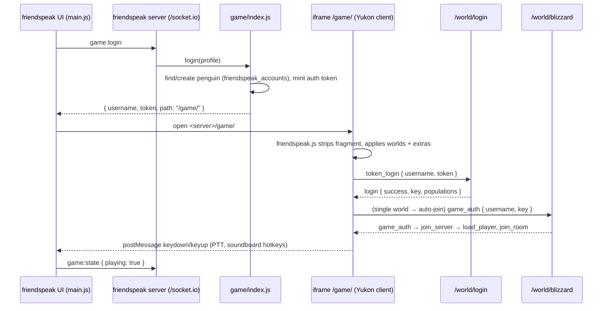

# Penguin game (Yukon) integration

The game is [Yukon](https://github.com/wizguin/yukon), an HTML5 (Phaser 3) client for a virtual penguin world, and [yukon-server](https://github.com/wizguin/yukon-server). Both are MIT-licensed, vendored and patched to run inside friendspeak. For the reasoning behind the design, see DECISIONS.md (D11–D19).

| | Upstream | Vendored at | Builds to |
|---|---|---|---|
| Client | `wizguin/yukon` @ `2f47b90` | `game/client/` | `game/client/dist/` (webpack) |
| Server | `wizguin/yukon-server` @ `fead5f7` | `game/server/` | `game/server/dist/` (Babel) |

Rebuild after **any** change under `game/*/src`:

```bash
npm run build:game      # babel server + webpack client (~10 s)
```

Then restart the friendspeak server or desktop app. The Babel config is `game/server/.babelrc` and the webpack config is `game/client/webpack.config.js`. Both use the **root** `node_modules`; the vendored `package.json` files are metadata only.

## Runtime flow



What `game/index.js` does at startup:

1. **Refuses to start** unless both `dist` builds exist. The reason is shown in the UI and in the startup log.
2. **Serves the client:**
   - `/game/friendspeak.js` holds `window.FRIENDSPEAK_GAME = { worlds }`. The Yukon client normally gets world addresses from `crumbs.worlds`.
   - `/game/lib` serves Phaser 3.80.1 from npm.
   - `/game` serves `client/dist`.
   - Every asset dir is mounted at both `/game/assets` and `/assets`.
3. **Checks for assets:** if no asset dir has `media/preload/preload-pack.json`, it reports "assets missing" and doesn't start the worlds.
4. **Starts the worlds** with a generated config:
   - The secret is created once in `dataDir/game-secret`.
   - SQLite lives at `dataDir/game.sqlite`.
   - Rate limiting is on.
   - `preferredSpawn` is 100 (the Town).
5. **Creates `friendspeak_accounts`** (profile id → Yukon user id).

## Assets

Assets aren't in git (third-party art, not redistributable). Directories are searched in this order, first match wins per file:

1. `GAME_ASSETS_DIR` env
2. `startServer({ gameAssetsDir })`: the desktop app passes `userData/game-assets`
3. `game/client/assets/`: Yukon's own `styles/` and `scripts/lib`, plus wherever upstream says to merge a pack
4. `game/assets-pack/`: an upstream-compatible asset pack
5. `game/assets-extra/`: art for the extra rooms (same layout as a pack)

**Compatibility check for a new pack:** `media/crumbs/en/crumbs.json` must contain these keys: `rooms`, `pets`, `widgets`, `sounds`, `missions`, `games`, `items`, `igloos`, `furniture`, `strings`, `secret_frames`, `worlds`, … (the same 23 files as `game/client/utils/build-crumbs.js`). `media/rooms/<name>/` must exist for every scene in `game/client/src/scenes/rooms/`, and `media/igloos/` must exist too. Packs built for modified forks have different crumbs and won't load.

## Patch inventory

Every change to vendored code. Keep this list current. Search for `friendspeak` to find markers (a few door edits in room files aren't marked; they're listed below).

### Server (`game/server/`)

| File | Change |
|---|---|
| `src/World.js` | Rewritten. `startWorlds(config)` export: shared DB, awaits schema, seeds world rows, in-process worlds. The standalone CLI path is kept. `config.logging` controls packet logs. |
| `src/server/Server.js` | Attaches to `world.httpServer` at `world.path` instead of listening on a port. `destroyUpgrade: false`. |
| `src/database/Database.js` | SQLite dialect with `storage` and the `sqliteDriver` dialect module. `ready` promise. `createSqliteSchema()` runs `schema.sqlite.sql`. |
| `src/database/sqliteDriver.js` | **New.** sqlite3-compatible driver over `node:sqlite`. It rewrites numbered bind params to named ones, maps error codes, and silences the experimental warning. |
| `schema.sqlite.sql` | **New.** SQLite port of `yukon.sql`: tables, indexes, the `trigger_users_insert` trigger, `username COLLATE NOCASE`. |
| `src/objects/user/User.js`, `GameUser.js` | Ban expiry `[Op.gt]: new Date()` (was `Date.now()`). |
| `.babelrc` | Alias `bcrypt` → `bcryptjs`. |
| `data/rooms.json` | Added 15 extra rooms (122, 318, 330, 340, 410, 411, 420–423, 804, 808, 813–815). Added game rooms 905 and 906 (in the asset pack, but missing upstream), plus 910, 930 and 955. |
| `package.json` | Replaced with a metadata stub. `ecosystem.config.js` and `package-lock.json` removed. |

### Client (`game/client/`)

| File | Change |
|---|---|
| `src/engine/friendspeak/friendspeak.js` | **New.** Parses `#u=&t=` (then strips it). `applyWorlds()` points worlds at this origin. `applyExtraRooms()` merges `extras.js` into crumbs where missing. `login()` does the token login. `notify()` posts to the parent. Forwards keydown/keyup to the parent iframe host. |
| `src/engine/friendspeak/extras.js` | **New.** Data for the extra rooms, games (910 Pizzatron, 930 DJ3K, 955 Puffle Rescue) and strings. |
| `src/engine/boot/Preload.js` | Calls `friendspeak.applyWorlds` and `applyExtraRooms` after crumbs load. |
| `src/scenes/interface/menus/start/Start.js` | Compiled `create()` renamed to `_create()`. A new `create()` auto-logs in once. Start/Create buttons log in via token. |
| `src/scenes/interface/menus/login/Login.js` | "Create penguin" no longer navigates to `/create`. |
| `src/scenes/interface/menus/servers/Servers.js` | Auto-joins when there's exactly one world. |
| `src/scenes/rooms/RoomScene.js` | `checkTrigger`: a null trigger shows "closed for construction". `triggerRoom`: `(0,0)` means the room's default spawn. No-op shims `changeLayerMutes`, `rewindLayers`, `stampEarned`. |
| `src/engine/world/penguin/ClientController.js` | Adds `hasItem`, `hasItems`, and a no-op `stampEarned` (used by the extra rooms). |
| `src/scenes/components/components.js` | Exports `HoverAnimation` and `ZoneTrigger`. |
| `src/scenes/components/HoverAnimation.js`, `ZoneTrigger.js` | **New.** Used by the extra rooms. |
| `src/engine/loaders/ItemIconLoader.js` | **New** (used by `RoomPin`). |
| `src/scenes/rooms/RoomPin.js` | **New**: collectible pins in rooms. |
| `src/scenes/rooms/dojo/mat.js` | **New** (used by the Hideout). |
| `src/scenes/shared_prefabs/tables/treasurehunt/*` | **New.** Visual only; the seats are disabled. |
| `src/scenes/rooms/{15 rooms}/` | **New**: the extra rooms (see the table below). |
| Door wiring (unmarked edits) | `beach/Beach.js` (lighthouse → 410, ship → 420), `cave/Cave.js` (boiler → 804, mine → 808), `dance/Dance.js` (boiler → 804, mix → game 930), `dojoext/DojoExt.js` (dojohide → 318), `forest/Forest.js` (lake → 814), `pet/Pet.js` (adopt → `AdoptCatalog` widget), `plaza/Plaza.js` (pizza → 330, stage1/2 → 340), `shack/Shack.js` (eco → 122, mine → 808) |
| Extra-room tweaks | `beacon/Beacon.js` jetpack → game 906. `mine/Mine.js` rescue → 955. `pizza/Pizza.js` pizza job stubbed, pizzaoven → null. `shipquarters/ShipQuarters.js` treasure-hunt seats → null. `lighthouse/Lighthouse.js` `this.client` → `this.world.client`. |
| `webpack.config.js` | Obfuscator removed. Aliases `@friendspeak` and `@rooms` added. |
| `index.ejs`, `index.html` | GitHub corner link removed. Title changed. Phaser comes from `lib/phaser.min.js` instead of the CDN. Loads `friendspeak.js` before the bundle. Ruffle still comes from jsDelivr. |
| `package.json` | Metadata stub. `editor/`, `create/` (PHP signup) and `phasereditor2d.config.json` weren't vendored. |

## Extra rooms

Upstream Yukon leaves these doors as `null`. friendspeak adds the rooms behind them.

| Id | Room | Scene | Spawn (x, y) | Art (`assets-extra/media/rooms/…`) | Reached from |
|---|---|---|---|---|---|
| 122 | Recycling Plant | `eco/Eco` | 1120, 640 | `eco` | Mine Shack |
| 318 | Ninja Hideout | `hideout/Hideout` | 836, 689 | `hideout` | Dojo Courtyard |
| 330 | Pizza Parlor | `pizza/Pizza` | 827, 502 | `pizza` | Plaza |
| 340 | Stage | `stage/Stage` | 340, 652 | `stage/stage-basic` | Plaza |
| 410 | Lighthouse | `lighthouse/Lighthouse` | 568, 508 | `lighthouse` | Beach |
| 411 | Beacon | `beacon/Beacon` | 328, 701 | `beacon` | Lighthouse |
| 420 | Migrator | `ship/Ship` | 840, 680 | `ship` | Beach |
| 421 | Ship Hold | `shiphold/ShipHold` | 873, 605 | `shiphold` | Migrator |
| 422 | Captain's Quarters | `shipquarters/ShipQuarters` | 873, 605 | `shipquarters` | Ship Hold |
| 423 | Crow's Nest | `shipnest/Shipnest` | 873, 605 | `shipnest` | Migrator |
| 804 | Boiler Room | `boiler/Boiler` | 862, 733 | `boiler` | Night Club, Cave |
| 808 | Mine | `mine/Mine` | 760, 680 | `mine` | Mine Shack, Cave |
| 813 | Underground Mine | `cavemine/Cavemine` | 840, 480 | `cavemine` | Mine |
| 814 | Hidden Lake | `hiddenlake/HiddenLake` | 460, 285 | `hidden_lake` | Forest |
| 815 | Underwater | `underwater/Underwater` | 760, 480 (guess) | `underwater` | Hidden Lake |

Beacon and Pizza use the regular scenes, not party variants.

### Minigames added

| Id | Game | Art | Notes |
|---|---|---|---|
| 905 | Cart Surfer | asset pack | server room added (missing upstream); prompt string added |
| 906 | Jet Pack Adventure | asset pack | server room added; the Beacon uses 906 |
| 910 | Pizzatron 3000 | `flash/games/pizzatron` | |
| 930 | DJ3K | `flash/games/dj3k` | Night Club "Mix" |
| 955 | Puffle Rescue | `flash/games/rescue` | 955 because 927 is Mission 11 in the asset pack |

Flash games run through Ruffle, loaded by `index.ejs` from jsDelivr, so they need internet access.

### Not implemented (needs server logic)

- Pizza delivery job (`PizzaWork`)
- Treasure Hunt tables
- The Lighthouse's layered band music (the room's normal music plays)
- Stamps
- Catalogs and widgets the extra rooms reference but nothing provides: `MusicCatalog`, `Telescope`, `RockHopper`, `Martial`, `Voyager`, `CJNinjaProgress` (`loadWidget` ignores unknown keys)
- The Pizza Parlor oven game (943)
- The multiplayer Dance Contest (952)

## Recipes

### Add a room
1. **Write the scene** in `src/scenes/rooms/<name>/` (`RoomScene` subclass plus its `*-pack.json` preload). Resolve imports: `@rooms/*` works. Mark anything you stub with a `friendspeak:` comment.
2. **Check the packs resolve:** every `url`/`atlasURL` inside the room's `*-pack.json` must exist in some asset dir.
3. **Register the room:** add it to `extras.js` (`rooms`) and `game/server/data/rooms.json`.
4. **Wire a door:** in an existing room's `roomTriggers`, add `() => this.triggerRoom(<id>, x, y)` (use `0, 0` for the default spawn).
5. **Build and test:** `npm run build:game`, then `GAME_SPAWN=<id> npm start`, open the game, and check the console and network for errors.
6. **Record it** in the tables above.

### Update upstream Yukon
1. Clone the new upstream commits.
2. Diff them against the recorded commit (`git diff 2f47b90..<new>` for the client), and apply the diff to `game/client`, skipping `editor/`, `create/`, lockfiles and the obfuscator.
3. Re-check every file in the patch inventory still applies.
4. Update the commit hashes here, rebuild, and run the room sweep: spawn in each room and check for errors.

### Debugging
- Server packet log: `GAME_DEBUG=1 npm start`.
- Client packet log: in the game iframe's devtools console, `localStorage.logging = 'true'` and reload.
- Spawn straight into a room: `GAME_SPAWN=<id>`.
- Reset all penguins: stop the server and delete `data/game.sqlite*`. friendspeak profiles recreate penguins on the next login.
